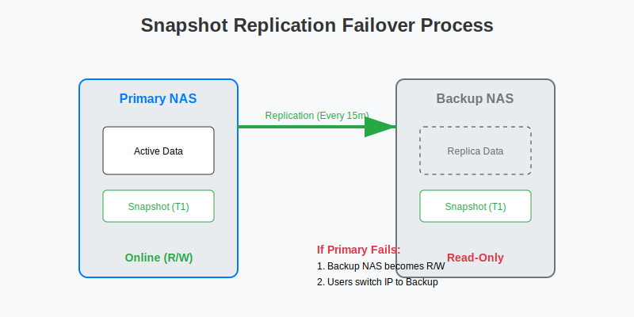

# Snapshot Replication：企业级异地容灾实战

对于企业或极客玩家来说，仅仅有本地快照是不够的。如果机房发生火灾、地震，或者 NAS 主板炸了，本地快照也会随之消失。
**Snapshot Replication** (快照复制) 是群晖提供的终极容灾方案。它能将快照通过网络（局域网或公网）实时复制到另一台 NAS 上。当主 NAS 挂掉时，备用 NAS 可以瞬间接管业务。

## 1. 架构设计

**故障转移流程图：**

*   **主 NAS (Source)**：运行业务（SMB, Docker, VMM）。
*   **备 NAS (Destination)**：位于异地（或楼下机房），只负责接收数据。
*   **要求**：
    *   两台 NAS 都必须使用 **Btrfs** 文件系统。
    *   网络互通（局域网最佳，公网建议通过 Site-to-Site VPN 互联）。

## 2. 配置复制任务

### 步骤 1：建立连接
1.  在两台 NAS 上都安装 **Snapshot Replication** 套件。
2.  在 **主 NAS** 上，打开 Snapshot Replication > **复制** > **远程**。
3.  输入备 NAS 的 IP、管理员账号、密码。

### 步骤 2：创建复制任务
1.  **主 NAS** > **复制** > **共享文件夹** > **创建**。
2.  选择要保护的文件夹（如 `Projects`）。
3.  **目的地**：选择刚才添加的备 NAS。
4.  **计划**：
    *   **频率**：最快支持 **每 5 分钟** 一次。建议设置为 15 分钟或 1 小时。
    *   **传输加密**：如果走公网，务必勾选。局域网可不选以提升速度。
5.  **初始复制**：
    *   如果数据量巨大（如 10TB）且带宽有限，可以选择 **通过存储设备导出**。先拷到移动硬盘，人工带到备 NAS 导入，然后再建立网络增量同步。

## 3. 灾难恢复流程 (Failover)

模拟场景：主 NAS 突然断电或硬盘全损。

### 场景 A：主 NAS 还能连上（计划内维护）
1.  **切换 (Switchover)**：
    *   在主 NAS 上，选择复制任务 > **操作** > **切换**。
    *   主 NAS 会把最后一点数据同步过去，然后将自己设为“只读”。
    *   备 NAS 的对应文件夹会自动变为“可读写”。
    *   **优点**：数据零丢失。

### 场景 B：主 NAS 彻底挂了（故障转移）
1.  **故障转移 (Failover)**：
    *   登录 **备 NAS**。
    *   打开 Snapshot Replication > **复制**。
    *   选择任务 > **操作** > **强制故障转移**。
    *   备 NAS 会立即激活该共享文件夹为“可读写”。
2.  **业务恢复**：
    *   将员工的 SMB 映射地址改为备 NAS 的 IP。
    *   或者在 DNS 服务器上修改域名指向备 NAS（业务无感知）。

### 场景 C：主 NAS 修好了（重保护）
1.  主 NAS 重新上线。
2.  在 **备 NAS** 上 > **操作** > **重新保护 (Re-protect)**。
3.  选择新的同步方向：**从备 NAS 同步回 主 NAS**。
4.  数据同步完成后，再执行一次 **切换**，把业务切回主 NAS。

## 4. 进阶：VMM 虚拟机容灾

Snapshot Replication 不仅能保护文件，还能保护虚拟机。
*   在 **Virtual Machine Manager** 中，可以为虚拟机设置“保护计划”。
*   原理相同：主 NAS 的虚拟机每 15 分钟同步到备 NAS。
*   **恢复**：主 NAS 挂了，在备 NAS 上点击“还原”，虚拟机直接在备 NAS 上启动。

## 5. 常见问题

*   **Q: 需要两台一模一样的 NAS 吗？**
    *   A: 不需要。备 NAS 性能可以差一点，只要硬盘空间够大即可。
*   **Q: 第一次复制太慢？**
    *   A: 第一次是全量复制，受限于带宽。后续都是增量复制，只传变化的数据块，速度极快。
*   **Q: 版本保留策略怎么设？**
    *   A: 建议主 NAS 保留少一点（如 7 天），备 NAS 保留多一点（如 1 年）。这样主 NAS 空间压力小。
