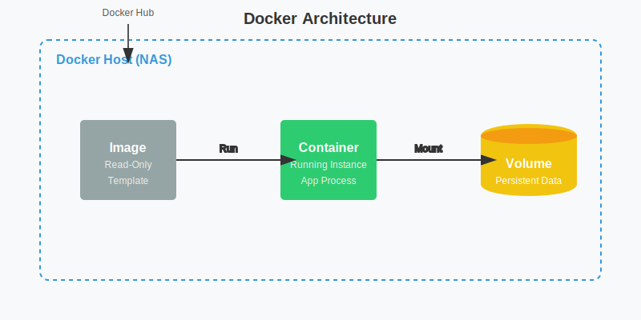

# Docker 与 Virtual DSM 实战

Container Manager (旧称 Docker) 是 Synology NAS 上最强大的功能之一，它能让你运行各种轻量级应用。

## 1. 基础：Container Manager 安装与配置

1.  **安装**：在“套件中心”搜索并安装 `Container Manager`。
2.  **映像 (Image)**：相当于软件安装包。在“注册表”中搜索并下载。
3.  **容器 (Container)**：运行中的软件实例。
4.  **卷 (Volume)**：数据持久化。**务必将容器内的数据目录映射到 NAS 的文件夹**，否则容器删除后数据会丢失。



## 2. 实战案例：部署 Virtual DSM (vDSM)

你可以通过 Docker 在 NAS 中运行另一个隔离的 DSM 系统（Virtual DSM），用于测试新系统、隔离高风险操作或作为独立的开发环境。

### 准备工作
- 确保你的 NAS 支持 KVM 虚拟化（大多数 Plus 系列都支持）。
- 确保已安装 Container Manager。

### 部署步骤 (Docker Compose 方式)

1.  **创建文件夹**：在 File Station 中创建一个文件夹，例如 `/docker/vdsm`。
2.  **创建项目**：
    - 打开 Container Manager > 项目 > 新增。
    - 项目名称：`virtual-dsm`。
    - 路径：选择 `/docker/vdsm`。
    - 来源：创建 docker-compose.yml。
3.  **填入配置**：
    ```yaml
    version: "3"
    services:
      dsm:
        container_name: dsm
        image: vdsm/virtual-dsm
        environment:
          DISK_SIZE: "16G"  # 虚拟磁盘大小
        devices:
          - /dev/kvm        # 必须支持 KVM
        cap_add:
          - NET_ADMIN
        ports:
          - 5000:5000       # 端口映射，主机端口:容器端口
        volumes:
          - /volume1/docker/vdsm/storage:/storage # 数据持久化
        restart: on-failure
        stop_grace_period: 2m
    ```
4.  **启动**：按照向导完成创建，容器会自动启动。
5.  **访问**：等待几分钟后，访问 `http://你的NAS_IP:5000` 即可看到全新的 DSM 安装界面。

### 注意事项
- **合法性**：vDSM 项目是合法的，但你需要遵守 Synology 的 EULA。通常建议在 Synology 硬件上运行。
- **性能**：性能取决于宿主机的 CPU 和分配的资源。
- **网络**：默认使用桥接网络，如果需要独立 IP，可以配置 macvlan 网络。

## 3. 常用 Docker 容器推荐

- **Jellyfin/Plex**：强大的媒体服务器。
- **Home Assistant**：智能家居控制中心。
- **Bitwarden (Vaultwarden)**：自托管密码管理器。
- **Portainer**：更强大的 Docker 图形化管理工具。
