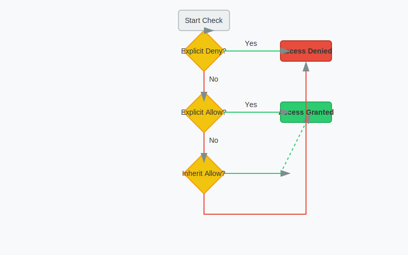

# DSM 权限体系底层逻辑 (Permission Logic)

很多用户分不清 Linux 权限、ACL 权限、用户与群组的关系，导致设置出来的权限不仅乱，而且不安全。本文将带你深入理解 DSM 的权限底层逻辑。

## 1. 权限双轨制：Linux vs ACL

DSM 基于 Linux，但它的权限管理比标准 Linux 复杂得多。它采用了 **双重权限系统**：

*   **Linux 权限 (基础)**：
    *   **对象**：所有文件和文件夹。
    *   **模式**：`rwx` (读/写/执行)。
    *   **适用**：SSH 登录、Docker 挂载、脚本运行。
    *   **局限**：只能设置 Owner (所有者)、Group (所属组)、Others (其他人) 三种身份，无法实现“张三能读，李四能写，王五只能看前两页”这种精细控制。

*   **ACL (Access Control List, 进阶)**：
    *   **对象**：共享文件夹及其子文件夹。
    *   **模式**：Windows 风格的权限控制列表。
    *   **适用**：File Station, SMB, AFP, Drive, Photos。
    *   **优势**：支持无限个用户/群组的精细控制，支持权限继承。
    *   **本质**：DSM 在 Linux 文件系统 (Ext4/Btrfs) 上扩展了 ACL 属性 (`synoacl`)。

**结论**：在 DSM 界面操作时，你实际上是在配置 ACL。但在 SSH 命令行操作时，你看到的是 Linux 权限（外加一个 `+` 号表示有 ACL）。

## 2. 权限优先级 (Priority Logic)

当一个用户同时属于多个群组，或者既有用户权限又有群组权限时，谁说了算？

**黄金法则：拒绝 > 显式允许 > 继承允许**

1.  **拒绝 (Deny) 最高优先级**：
    *   如果用户张三属于 Group A (允许读写) 和 Group B (拒绝访问)。
    *   **结果**：**拒绝访问**。
    *   **警告**：千万不要在 `users` 组设置“拒绝”，否则所有人（包括管理员）都会失去权限！

2.  **显式权限 (Explicit) > 继承权限 (Inherited)**：
    *   **文件夹 A** (父目录)：允许 Group A 读取。
    *   **文件夹 A/B** (子目录)：手动设置为“禁止 Group A 读取”。
    *   **结果**：在子目录 B，Group A **无法读取**。显式设置覆盖了从父目录继承下来的权限。

3.  **用户权限 vs 群组权限**：
    *   **没有优先级之分**，它们是**叠加**的。
    *   用户张三 (只读) + Group A (读写) = **读写**。
    *   用户张三 (禁止) + Group A (读写) = **禁止** (因为拒绝优先)。

## 3. 权限继承 (Inheritance)

这是 ACL 的精髓，也是最容易乱的地方。

*   **默认行为**：新建子文件夹会自动继承父文件夹的权限。
*   **中断继承**：
    *   在 File Station 右键 > 属性 > 权限 > 高级选项 > **使继承权限显式化**。
    *   **作用**：把当前从父目录继承来的权限“固化”为当前文件夹的显式权限，并切断与父目录的联系。以后父目录权限变了，这个子文件夹不会跟着变。
    *   **场景**：部门共享文件夹里有一个“绝密”子文件夹，只允许经理看。你需要中断继承，然后删除所有人的权限，只加经理。

## 4. 特殊权限位详解

DSM 的权限不只是“读写”那么简单。

*   **管理权限**：
    *   **更改权限**：允许修改 ACL。通常只给管理员。
    *   **取得所有权**：强行把文件的 Owner 改成自己。

*   **读取权限**：
    *   **遍历文件夹/执行文件**：这是进入文件夹的门票。如果没有这个权限，连文件夹都进不去。
    *   **列出文件夹/读取数据**：这是看文件列表的权限。
    *   **读取属性**：查看文件大小、时间等。

*   **写入权限**：
    *   **创建文件/写入数据**：新建文件。
    *   **创建文件夹/附加数据**：新建子文件夹。
    *   **写入属性**：修改文件时间戳。
    *   **删除**：**这是最关键的**。
    *   **删除子文件夹和文件**：同上。

## 5. 实战案例：收作业模式 (Drop Box)

老师想让学生上传作业，但学生**只能上传，不能看别人的，也不能删自己的**。

1.  创建共享文件夹 `Homework`。
2.  设置 `Students` 群组权限：
    *   **应用到**：此文件夹、子文件夹和文件。
    *   **读取**：**不勾选**“列出文件夹/读取数据”。(学生看不到文件列表，保护隐私)
    *   **写入**：
        *   勾选“创建文件/写入数据”。(允许上传)
        *   **不勾选**“删除”。(禁止删除)
3.  **结果**：学生只能往里“扔”文件，扔进去就消失了（其实还在，只是看不到）。老师作为管理员可以看到所有文件。

## 6. 实战案例：只读防删除 (Read Only)

公司资料库，允许员工查看和修改，但**严禁删除**。

1.  设置 `Staff` 群组权限：
    *   **读取**：全勾选。
    *   **写入**：
        *   勾选“创建文件/写入数据”。(允许新建/修改)
        *   **不勾选**“删除”和“删除子文件夹和文件”。
2.  **坑点**：很多软件（如 Office Word）保存文件时，机制是“新建临时文件 -> 删除原文件 -> 重命名临时文件”。如果禁止了删除权限，**Word 保存会报错**。
    *   **解决**：这种场景下，建议使用 **版本控制 (Synology Drive)** 或 **快照** 来防误删，而不是简单粗暴地禁止删除权限。

## 7. `homes` 文件夹的权限逻辑 (再强调)

*   **普通用户**：对 `/volume1/homes` **无权限**。
*   **Owner (自己)**：对 `/volume1/homes/自己` **拥有完全控制权**。
*   **管理员**：对 `/volume1/homes` **拥有完全控制权**。

**切记**：永远不要手动修改 `/volume1/homes` 的权限！一旦你赋予 `users` 组读取权限，所有人的隐私都将暴露。
