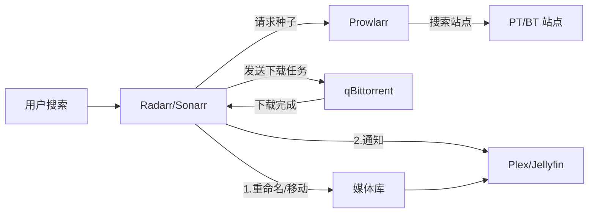

# 自动化追剧全家桶 (Arr Suite) 详解

在 NAS 圈子里，"Arr" 系列软件（Radarr, Sonarr, Lidarr...）是自动化的代名词。配合 Prowlarr（索引器）和下载器（qBittorrent），你可以实现：**想看什么电影，在手机上搜一下，NAS 自动下载、刮削、整理、通知，回家打开电视就能看。**

## 核心组件介绍

*   **Radarr**: 电影自动化管理。
*   **Sonarr**: 电视剧/动漫自动化管理。
*   **Lidarr**: 音乐自动化管理。
*   **Readarr**: 电子书自动化管理。
*   **Prowlarr**: 索引器管理（替代 Jackett）。它负责连接各大 PT/BT 站，把种子信息喂给 Radarr/Sonarr。
*   **Bazarr**: 字幕自动化下载。

## 架构图



## 部署 (Docker Compose)

为了方便管理，建议将它们放在同一个 `docker-compose.yml` 中，并使用相同的网络。

```yaml
version: "3"
services:
  prowlarr:
    image: lscr.io/linuxserver/prowlarr:latest
    container_name: prowlarr
    environment:
      - PUID=1026
      - PGID=100
      - TZ=Asia/Shanghai
    volumes:
      - /volume1/docker/prowlarr/config:/config
    ports:
      - 9696:9696
    restart: unless-stopped

  radarr:
    image: lscr.io/linuxserver/radarr:latest
    container_name: radarr
    environment:
      - PUID=1026
      - PGID=100
      - TZ=Asia/Shanghai
    volumes:
      - /volume1/docker/radarr/config:/config
      - /volume1/video/movies:/movies # 媒体库
      - /volume1/downloads:/downloads # 下载目录
    ports:
      - 7878:7878
    restart: unless-stopped

  sonarr:
    image: lscr.io/linuxserver/sonarr:latest
    container_name: sonarr
    environment:
      - PUID=1026
      - PGID=100
      - TZ=Asia/Shanghai
    volumes:
      - /volume1/docker/sonarr/config:/config
      - /volume1/video/tv:/tv # 媒体库
      - /volume1/downloads:/downloads # 下载目录
    ports:
      - 8989:8989
    restart: unless-stopped
```

## 配置流程 (保姆级)

### 1. 配置 Prowlarr
1.  打开 `http://nas-ip:9696`。
2.  **Settings > Indexers**: 添加你的 PT 站账号或公共 BT 站。
3.  **Settings > Apps**: 添加 Radarr 和 Sonarr。
    *   Prowlarr 会自动把配置好的索引器同步给它们，无需在 Radarr 里一个个加。
    *   你需要去 Radarr/Sonarr 的设置里获取 API Key 填入 Prowlarr。

### 2. 配置 Radarr/Sonarr
1.  **Media Management**: 开启 "Rename Movies" (重命名)。设置好命名格式（如 `{Movie Title} ({Release Year}) {Quality Full}`）。
    *   *关键：一定要开启“硬链接 (Hardlink)”。这样下载目录和媒体库目录是同一个文件的两个入口，不占用双倍空间，且能保持做种。*
2.  **Download Clients**: 添加 qBittorrent。
    *   Host: `nas-ip`
    *   Port: `8080`
    *   Category: `radarr` (建议分类，方便管理)
3.  **Root Folders**: 设置你的媒体库路径（如 `/movies`）。

### 3. 开始使用
1.  点击左上角 **Add New**。
2.  搜索你想看的电影（如 "Inception"）。
3.  选择质量配置（如 "Any" 或 "1080p"）。
4.  点击 **Add + Search**。
5.  系统会自动去 Prowlarr 找种子 -> 发送给 qBittorrent -> 下载完自动移动并重命名 -> 通知 Jellyfin 刷新。

## 常见问题

*   **硬链接失败**：确保下载目录 (`/downloads`) 和媒体库目录 (`/video`) 在同一个磁盘分区（Volume）上，并且 Docker 挂载路径要科学。
    *   *最佳实践*：直接挂载根目录 `/volume1:/data`，然后在软件里分别指向 `/data/downloads` 和 `/data/video`，这样原子移动操作最稳。
*   **搜索不到中文资源**：Radarr 原生对中文搜索支持一般。建议在 Prowlarr 索引器设置中，针对中文站点开启具体的搜索参数，或者配合 **AutoSymlink** 等工具使用。
*   **无法连接各大数据库**：Radarr 需要访问 TMDB，Sonarr 需要访问 TVDB。由于网络原因，可能需要修改 Hosts 或配置 HTTP 代理。
