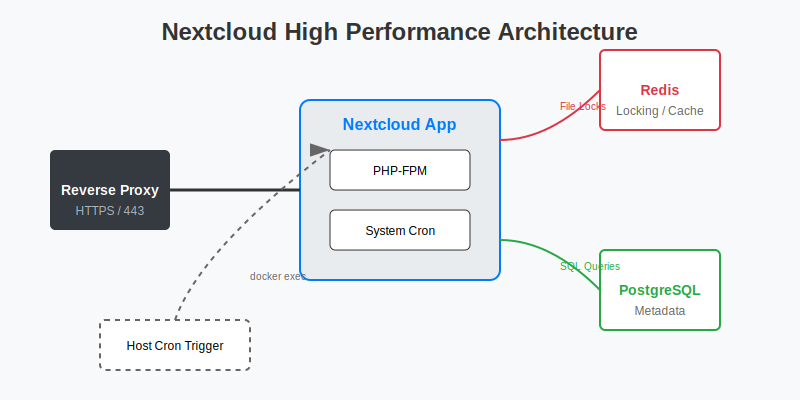

# Nextcloud 深度调优：从“卡顿”到“丝滑”

Nextcloud 是功能最强大的私有云盘，但也是出了名的“重”。很多用户在 Docker 部署后发现网页打开慢、相册缩略图加载不出来、同步经常出错。这通常是因为缺少**缓存**、**后台任务**和**PHP 调优**。

## 1. 核心加速组件：Redis

**Nextcloud 高性能架构图：**



Nextcloud 必须配合 Redis 使用，否则文件锁 (File Locking) 会导致数据库压力过大，网页响应极慢。

### A. 部署 Redis
在你的 `docker-compose.yml` 中添加 Redis 服务。

```yaml
services:
  redis:
    image: redis:alpine
    container_name: redis
    restart: always
```

### B. 配置 Nextcloud 连接 Redis
修改 Nextcloud 的配置文件 `config/config.php`。
*   **位置**: 映射出来的 `/var/www/html/config/config.php`。
*   **添加内容**:
    ```php
    'memcache.local' => '\OC\Memcache\APCu',
    'memcache.distributed' => '\OC\Memcache\Redis',
    'memcache.locking' => '\OC\Memcache\Redis',
    'redis' => [
      'host' => 'redis', // 对应 docker-compose 中的 service name
      'port' => 6379,
    ],
    ```
*   **注意**: 官方 Docker 镜像默认未启用 APCu，你可能需要在 Dockerfile 中自行构建或使用第三方优化镜像 (如 `linuxserver/nextcloud`)。

## 2. 后台任务 (Cron Jobs)

默认情况下，Nextcloud 使用 `AJAX` 方式执行后台任务（即每次有人访问网页时才顺便跑一下任务）。这会导致页面加载变慢，且任务执行不及时。

### A. 切换为 Cron 模式
1.  登录 Nextcloud 网页 > **管理设置** > **基本设置**。
2.  将“后台任务”设置为 **Cron**。

### B. 配置宿主机 Cron
我们需要在宿主机 (NAS) 上定时触发容器内的 cron 脚本。

1.  **SSH 登录 NAS**。
2.  **编辑 Crontab**: `vi /etc/crontab` (或者使用群晖任务计划)。
3.  **添加任务**: 每 5 分钟执行一次。
    ```bash
    */5 * * * * root docker exec -u www-data nextcloud php cron.php
    ```
    *(注意: `nextcloud` 是你的容器名，`www-data` 是容器内运行 Nextcloud 的用户，官方镜像通常是 `www-data`，LinuxServer 镜像可能是 `abc`)*

## 3. PHP-FPM 进程调优

如果你有很多人同时使用 Nextcloud，或者在同步大量小文件，默认的 PHP 进程数可能不够用。

### A. 修改 php.ini / www.conf
这通常需要通过 Docker 挂载配置文件来实现，或者使用环境变量（取决于镜像）。

*   **LinuxServer 镜像**:
    *   在 `/config/php/php-local.ini` 中添加：
        ```ini
        memory_limit = 512M
        upload_max_filesize = 16G
        post_max_size = 16G
        max_execution_time = 3600
        ```
*   **pm.max_children**:
    *   根据你的内存大小调整。
    *   **计算公式**: (总内存 - 数据库内存 - 系统预留) / 64MB。
    *   例如 4GB 内存，分给 PHP 2GB，大概可以开 `30` 个进程。

## 4. 预览图生成 (Preview Generation)

打开相册卡顿，通常是因为 Nextcloud 正在实时生成缩略图。

### A. 安装 Preview Generator 插件
1.  在 Nextcloud 应用商店搜索并安装 **Preview Generator**。
2.  **首次运行** (生成所有已有图片的预览图，耗时极长！):
    ```bash
    docker exec -u www-data nextcloud php occ preview:generate-all
    ```
3.  **定时任务**:
    *   在 Crontab 中添加，每 10 分钟预生成新图片的预览图。
    *   ```bash
        */10 * * * * root docker exec -u www-data nextcloud php occ preview:pre-generate
        ```

### B. 启用 HEIC/HEIF 支持
iPhone 用户必须开启。
*   确保 `config.php` 中有 `'enable_previews' => true,`。
*   在 `enabledPreviewProviders` 数组中添加 `'OC\Preview\HEIC',`。

## 5. 数据库调优

Nextcloud 极度依赖数据库性能。
*   **强烈建议使用 PostgreSQL 或 MariaDB**，不要用 SQLite。
*   **数据库调优**: 请参考 [数据库容器深度调优](database-tuning.md)。

## 6. 消除安全警告

在“管理设置 > 概览”中，你可能会看到一堆红色的安全警告。

*   **HSTS**: 参考 [反向代理指南](../network/reverse-proxy.md) 在 Nginx Proxy Manager 中开启 HSTS。
*   **.well-known 重定向**:
    *   如果你用 Nginx Proxy Manager，在“Advanced”选项卡中添加：
        ```nginx
        location /.well-known/carddav {
            return 301 $scheme://$host/remote.php/dav;
        }
        location /.well-known/caldav {
            return 301 $scheme://$host/remote.php/dav;
        }
        ```
*   **信任域 (Trusted Domains)**:
    *   如果通过新域名访问提示“不受信任的域名”，修改 `config/config.php`:
        ```php
        'trusted_domains' => 
        array (
          0 => '192.168.1.100:8080',
          1 => 'cloud.yourdomain.com',
        ),
        ```
