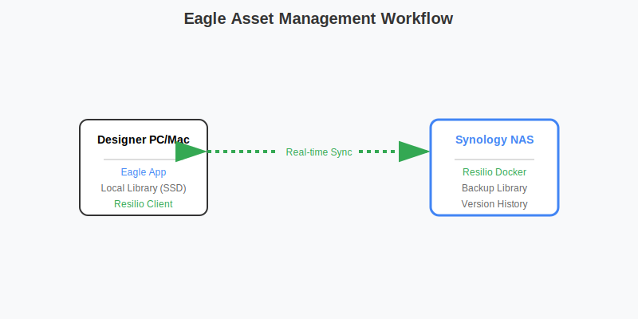

# 设计师与创意工作者：构建高速素材库与协作平台

对于 UI/UX 设计师、平面设计师和插画师来说，**素材管理 (Asset Management)**、**版本控制**和**大文件交付**是核心需求。群晖 NAS 可以作为您的私有素材云和协作中心。

## 核心痛点与解决方案

| 痛点 | 解决方案 | 核心技术 |
| :--- | :--- | :--- |
| **素材管理 (Eagle)** | 集中存储与同步 | SMB / Resilio Sync |
| **字体管理** | 团队字体库共享 | FontBase + Synology Drive |
| **设计稿版本混乱** | 自动版本控制 | Synology Drive (32 版本) |
| **大文件交付 (PSD)** | 极速分享链接 | File Station |
| **灵感收集** | 稍后阅读与归档 | Wallabag (Docker) |

## 1. Eagle 素材库的 NAS 最佳实践

**工作流对比示意图：**



[Eagle](https://cn.eagle.cool/) 是设计师必备的素材管理工具。虽然官方不推荐直接放在 NAS 上（可能会有数据库锁定问题），但通过合理配置可以实现。

### 方案 A：SMB 直连（推荐万兆网络）
如果您的局域网是万兆 (10GbE) 环境，可以直接将 Eagle 库放在 NAS 的 SMB 共享文件夹中。
*   **优点**：不占用本地硬盘空间。
*   **缺点**：如果网络不稳定，可能会导致 Eagle 数据库损坏；**严禁多人同时打开同一个库**。

### 方案 B：Resilio Sync 双向同步（推荐）
在 NAS (Docker) 和本地电脑都安装 Resilio Sync，将 NAS 作为主库，本地作为缓存库。
*   **优点**：本地操作速度极快，自动静默同步到 NAS 备份。
*   **部署 Resilio Sync (Docker)**:
    ```yaml
    version: '3'
    services:
      resilio-sync:
        image: linuxserver/resilio-sync
        container_name: resilio-sync
        environment:
          - PUID=1026
          - PGID=100
          - TZ=Asia/Shanghai
        volumes:
          - /volume1/docker/resilio-sync/config:/config
          - /volume1/design_assets:/downloads
          - /volume1/design_assets:/sync
        ports:
          - 8888:8888
          - 55555:55555
        restart: unless-stopped
    ```

## 2. 团队字体库管理

设计团队经常遇到“缺少字体”的报错。建立一个共享的字体库。

1.  **建立共享文件夹**：`/Design_Resource/Fonts`。
2.  **分类整理**：按厂商（方正、汉仪）或类型（衬线、非衬线）分类。
3.  **客户端工具**：使用 [FontBase](https://fontba.se/) (免费)。
    *   在 FontBase 中添加 NAS 的字体文件夹作为 `Root Folder`。
    *   所有团队成员都能看到最新的字体，点击圆圈即可一键激活，无需安装进系统。

## 3. 设计稿版本控制与协作

不要再保存 `final_v1.psd`, `final_v2_真的最后版.psd` 了。

### Synology Drive 版本回溯
1.  将设计项目文件夹纳入 Synology Drive 同步。
2.  **历史版本**：Drive 默认保留 32 个历史版本。
3.  **误删恢复**：在网页端 Drive 的“回收站”中可以找回被误删的图层文件。

### Figma 本地化备份
虽然 Figma 是云端的，但为了防止断网或账号问题，建议定期备份 `.fig` 文件。
*   使用脚本定期调用 Figma API 下载备份到 NAS（需编写脚本）。
*   或者手动导出关键节点的 `.fig` 文件归档到 NAS。

## 4. 推荐 Docker 设计工具

### Stirling-PDF (全能 PDF 工具箱)
完全免费、本地运行的 PDF 处理工具。支持合并、拆分、压缩、OCR、转换。
*   **部署**:
    ```yaml
    version: '3.3'
    services:
      stirling-pdf:
        image: frooodle/s-pdf:latest
        ports:
          - '8086:8080'
        volumes:
          - /volume1/docker/stirling-pdf/trainingData:/usr/share/tessdata # OCR 数据
        environment:
          - DOCKER_ENABLE_SECURITY=false
    ```

### Penpot (开源 Figma 替代)
如果你担心 Figma 的数据安全，或者需要完全私有化的原型设计工具。
*   **部署**：需要 Postgres 和 Redis 支持，建议使用 Docker Compose 部署全栈。

### Draw.io (流程图)
本地部署 Draw.io，画图更流畅，且数据不出内网。
*   **镜像**：`jgraph/drawio`
*   **端口**：8080

## 5. 灵感收集：Wallabag

**Wallabag** 是一个开源的“稍后阅读”工具，可以保存网页文章、设计灵感，并离线存储到 NAS。

### 5.1 Docker Compose 部署

```yaml
version: '3'
services:
  wallabag:
    image: wallabag/wallabag
    environment:
      - MYSQL_ROOT_PASSWORD=wallaroot
      - SYMFONY__ENV__DATABASE_DRIVER=pdo_mysql
      - SYMFONY__ENV__DATABASE_HOST=db
      - SYMFONY__ENV__DATABASE_PORT=3306
      - SYMFONY__ENV__DATABASE_NAME=wallabag
      - SYMFONY__ENV__DATABASE_USER=wallabag
      - SYMFONY__ENV__DATABASE_PASSWORD=wallapass
      - SYMFONY__ENV__DOMAIN_NAME=https://wallabag.yourdomain.com
    ports:
      - "8090:80"
    volumes:
      - /volume1/docker/wallabag/images:/var/www/wallabag/web/assets/images
    depends_on:
      - db
  db:
    image: mariadb
    environment:
      - MYSQL_ROOT_PASSWORD=wallaroot
    volumes:
      - /volume1/docker/wallabag/data:/var/lib/mysql
```

### 5.2 浏览器插件集成
1.  在 Chrome/Edge 安装 **Wallabag** 插件。
2.  配置服务器地址：`http://NAS_IP:8090` (或你的反代域名)。
3.  看到好的设计文章、图片，点击插件图标，一键保存到 NAS。
4.  支持手机端 APP 阅读。

## 6. 总结

| 需求 | 推荐工具 | 部署方式 |
| :--- | :--- | :--- |
| **素材管理** | **Eagle + Resilio Sync** | Docker / SMB |
| **字体共享** | **FontBase** | SMB 共享文件夹 |
| **版本控制** | **Synology Drive** | 套件 |
| **PDF 处理** | **Stirling-PDF** | Docker |
| **原型设计** | **Penpot** | Docker |
| **稍后阅读** | **Wallabag** | Docker |

通过这套方案，你可以构建一个完全私有、高速、无需月费的设计师专属工作流。

**核心优势总结**：利用 NAS 的大容量和 Docker 扩展性，设计师可以构建一个**永不丢失素材、随时高速访问**的私有设计中台。
