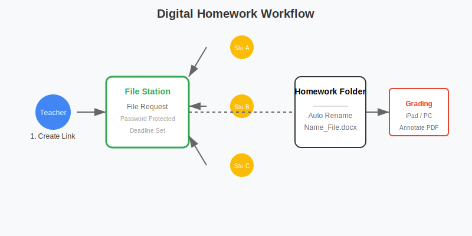

# 教育工作者与教师：从备课到课堂的数字化转型

对于教师、培训师和网课讲师，**教学资源管理**、**作业批改与存档**以及**网课视频发布**是核心工作。群晖 NAS 能够作为您的私有云课堂和教学资源库。

## 核心痛点与解决方案

| 痛点 | 解决方案 | 核心技术 |
| :--- | :--- | :--- |
| **课件多端同步** | 教室/家里/办公室无缝切换 | **Synology Drive** |
| **学生作业提交** | 统一收作业链接 | **File Station (请求文件)** |
| **网课视频存储** | 在线播放与分享 | **Video Station** / **Plex** |
| **试卷/教案归档** | 自动分类与全文检索 | **Universal Search** |
| **班级照片管理** | 智能相册与家长分享 | **Synology Photos** |

## 1. 备课神器：Synology Drive

不再需要把 U 盘插来插去，防止 U 盘中毒或丢失。

### 1.1 多端同步
*   **备课电脑 (家)**：安装 Drive Client，编辑 PPT。
*   **教室电脑 (公用)**：
    *   **方案 A**：直接用浏览器登录 Drive 网页端下载课件。
    *   **方案 B (推荐)**：使用 iOS/Android 平板投屏，直接打开 NAS 里的课件演示。
*   **版本回溯**：PPT 改乱了？右键文件 > 历史版本 > 还原到昨天晚上的版本。

### 1.2 协作备课
*   **教研组共享文件夹**：`/School/Math_Group`。
*   **Synology Office**：多人同时在线编辑一份教案或学生成绩表，无需传来传去 Excel 文件。

## 2. 作业收发与管理

**作业收发流程示意图：**

收几百份电子版作业，微信/QQ 会过期且混乱。

### 2.1 创建收作业链接 (File Station)
1.  在 File Station 创建文件夹 `/Homework/Class_1/Assignment_1`。
2.  右键文件夹 > **创建文件请求**。
3.  **设置**：
    *   **有效期**：截止日期 (如周五晚上 12 点)。
    *   **密码**：可选。
    *   **你的名字**：学生上传时需填写姓名，自动重命名文件为 `Name_Filename`。
4.  将链接发到班级群，学生点击链接上传，**互相看不到别人的作业**。

### 2.2 作业批改与归档
*   **iPad 批改**：在 iPad 上用 PDF Expert 连接 NAS (SMB/WebDAV)，直接在作业 PDF 上手写批注，保存后自动同步回 NAS。
*   **归档**：按学期、科目建立文件夹结构，方便日后查找优秀作业案例。

## 3. 网课视频库：Video Station / Plex

录制的网课视频太大，发给学生很慢。

### 3.1 搭建私有视频站
*   将网课视频放入 `/video/Course_A`。
*   **Video Station**：自动生成海报墙（虽然主要是电影，但也可以手动编辑元数据）。
*   **Plex**：界面更美观，支持全平台客户端。

### 3.2 分享给学生
*   **公开分享**：在 Video Station 中右键视频 > 公开分享 > 复制链接。
*   **权限控制**：设置密码，只发给报名的学生。学生无需下载，直接在线流畅播放（NAS 自动转码适应带宽）。

## 4. 班级活动照片管理：Synology Photos

运动会、春秋游的照片，如何发给家长？

### 4.1 智能分类
*   上传照片到 `/photo/Class_Activity`。
*   **人脸识别**：自动识别每个学生，方便查找特定孩子的照片。

### 4.2 家长分享
*   **创建相册**：选中某次活动的照片，点击分享。
*   **权限**：
    *   **公开链接**：发到家长群。
    *   **允许下载**：家长可以下载原图。
    *   **密码保护**：防止外人查看。

## 5. 试卷与题库管理

几十年的试卷、教案，如何快速找到“2018 年期末考试的压轴题”？

### 5.1 全文检索 (Universal Search)
*   **索引**：在控制面板 > 索引服务 > 索引文件夹列表，添加教案文件夹，勾选“文档”。
*   **搜索**：在 DSM 桌面右上角搜索框，输入题目关键词（如“牛顿第二定律”），不仅搜文件名，还能**搜 Word/PDF 文档里的内容**。

### 5.2 标签系统
*   给文件打标签：`#期中`, `#压轴题`, `#易错题`。
*   在 File Station 中点击标签，快速筛选出所有相关试卷。

---
**总结**：从备课同步、作业收集到资源归档，群晖 NAS 是教师的**数字化助教**，让您专注于教学本身，而不是被繁琐的文件管理所困扰。
