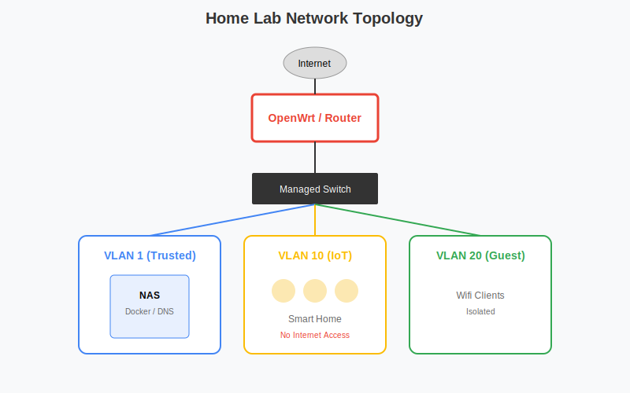

# 极客与 Home Lab：构建全栈家庭数据中心

对于喜欢折腾的极客、Home Lab 爱好者和全栈开发者，群晖 NAS 是您家庭网络的核心。本指南涵盖了从**网络架构**、**自动化监控**、**服务发现**到**虚拟化实验**的进阶玩法。

## 核心架构与工具栈

| 层级 | 工具/服务 | 核心功能 |
| :--- | :--- | :--- |
| **网络层** | **OpenWrt (VMM)** / **AdGuard Home** / **Tailscale** | 路由、DNS 过滤、内网穿透 |
| **应用层** | **Docker** / **Portainer** / **K3s** | 容器编排、轻量级 Kubernetes |
| **监控层** | **Prometheus** + **Grafana** / **Uptime Kuma** | 性能监控、服务状态 |
| **入口层** | **Homepage** / **Heimdall** / **Nginx Proxy Manager** | 导航页、反向代理 |
| **自动化** | **n8n** / **Watchtower** / **Home Assistant** | 流程自动化、镜像更新 |

## 1. 网络与安全基石

**Home Lab 网络拓扑图：**



### DNS 过滤与本地解析 (AdGuard Home)
不要依赖 ISP 的 DNS，保护隐私并去除广告。
*   **部署模式**：推荐 **Host 网络模式** 或 **Macvlan**，让 AdGuard Home 获取真实客户端 IP。
*   **上游 DNS**：配置 DoH/DoT (如 `https://dns.alidns.com/dns-query`) 防止劫持。
*   **DHCP**：如果路由器的 DHCP 功能太弱，可以关闭它，改用 AdGuard Home 的 DHCP Server。

### 网络隔离 (VLAN)
如果有支持 VLAN 的交换机 (如 Unifi, Mikrotik)，建议划分 VLAN：
*   **VLAN 1 (Trusted)**: 您的主力 PC、手机、NAS 主力网口。
*   **VLAN 10 (IoT)**: 智能家居设备 (米家、HomeKit)，禁止访问公网或只允许访问特定端口。
*   **VLAN 20 (Guest)**: 访客网络，完全隔离。
*   **NAS 配置**：控制面板 > 网络 > 网络界面 > 新增 > 创建 VLAN。

## 2. 服务发现与导航页 (Homepage)

服务太多记不住端口？部署一个高颜值的导航页。**Homepage** 是目前最流行的选择 (YAML 配置，性能极高)。

### 部署 Homepage
```yaml
version: "3.3"
services:
  homepage:
    image: ghcr.io/gethomepage/homepage:latest
    container_name: homepage
    ports:
      - 3000:3000
    volumes:
      - /volume1/docker/homepage/config:/app/config
      - /var/run/docker.sock:/var/run/docker.sock # 读取 Docker 状态
    environment:
      PUID: 1026
      PGID: 100
```
*   **集成**：支持直接显示 AdGuard Home 拦截数、Transmission 下载速度、Jellyfin 播放状态、Proxmox 虚拟机状态等。

## 3. 监控体系 (Observability)

### 基础监控：Uptime Kuma
*   监控所有服务 (HTTP/TCP/Ping) 的在线状态。
*   配置 Telegram/Discord/钉钉报警。
*   生成漂亮的 Status Page 公开展示。

### 进阶监控：Prometheus + Grafana + Node Exporter
*   **Node Exporter**：在 NAS 和其他服务器上运行，采集 CPU/内存/磁盘/网络指标。
*   **Prometheus**：刮取 (Scrape) 指标并存储。
*   **Grafana**：可视化展示。
*   **NAS 特有指标**：使用 [snmp-exporter](https://github.com/prometheus/snmp_exporter) 通过 SNMP 协议监控群晖的温度、风扇转速、RAID 状态。

## 4. 自动化运维

### Watchtower (自动更新容器)
*   **功能**：定期检查 Docker Hub，有新镜像自动拉取并重启容器。
*   **警告**：生产环境慎用！可能会导致不兼容的更新（Breaking Changes）。
*   **推荐配置**：只更新特定容器，或者配置 `WATCHTOWER_NOTIFICATIONS` 发送通知手动更新。

### n8n (工作流自动化)
开源的 Zapier/IFTTT 替代品。
*   **场景**：
    *   当 RSS 有更新 -> 推送到 Telegram。
    *   当收到特定邮件 -> 自动保存附件到 NAS 文件夹。
    *   每天定时 -> 查询服务器状态并生成报表。

## 5. 虚拟化实验场 (VMM & Docker)

### 运行 Windows/Linux
*   **VMM (Virtual Machine Manager)**：运行 Windows 11 或 Ubuntu Server。
*   **用途**：测试不信任的软件、运行 Docker 无法运行的应用 (如迅雷 Windows 版)、编译环境。

### Docker In Docker (Dind)
*   在 Docker 中运行 Docker，用于 CI/CD 构建环境。

## 6. 极客必备容器推荐

*   **Dozzle**：实时查看 Docker 容器日志的 Web 界面，支持搜索和过滤。
*   **Portainer**：可视化的 Docker 管理面板，支持 Stack (Compose) 部署。
*   **FileBrowser**：Web 版文件管理器，轻量级，适合替代 DSM File Station 给朋友分享文件。
*   **Speedtest-Tracker**：定期测速并记录曲线，监控宽带质量。
*   **IT-Tools**：开发者工具箱 (Base64, Hash, UUID, Converter...)。

## 7. 硬件直通与核显利用

*   **/dev/dri**：将核显直通给 Plex/Emby/Jellyfin 做硬解。
*   **USB 直通**：将 Zigbee/Z-Wave 棒直通给 Home Assistant 虚拟机。
*   **NVMe 缓存作存储**：通过脚本破解，将 NVMe SSD 用作高速存储池 (Basic/RAID 1)，存放 Docker 容器和虚拟机镜像，速度飞快。
