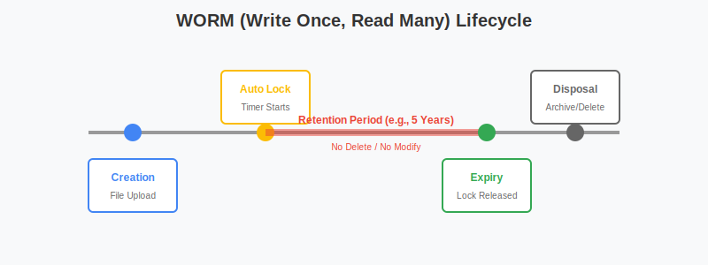

# 律师与财务人员：打造银行级数据保险箱

对于律师、会计师和金融从业者，**数据合规性 (Compliance)**、**安全性 (Security)** 和**审计追踪 (Audit Trail)** 是核心诉求。群晖 NAS 不仅是存储设备，更是符合 SOX、GDPR 等法规要求的企业数据金库。

本指南将深入讲解如何配置 **WORM** 防止文件篡改，如何用 **Paperless-ngx** 实现智能文档管理，以及如何自建 **DocuSeal** 电子签章系统。

## 1. 银行级防篡改：WORM 实战配置

在法律诉讼或财务审计中，电子证据的“真实性”至关重要。WORM (Write Once, Read Many) 技术确保文件一旦写入，在指定保留期内（如 5 年），连管理员（Root）都无法修改或删除。

### 1.1 创建合规文件夹
1.  **前提**：确保存储池支持 Btrfs 文件系统。
2.  **路径**：`控制面板` > `共享文件夹` > `新增`。
3.  **关键步骤**：在创建向导中，勾选 **“保护此共享文件夹免受意外更改 (WriteOnce)”**。
4.  **模式选择**（慎选！）：
    *   **企业模式 (Enterprise Mode)**：管理员可以在必要时删除整个文件夹（但不能修改单个文件）。适合内部归档。
    *   **合规模式 (Compliance Mode)**：**绝对不可删除**。即使用户离职、公司倒闭，只要硬盘还在，保留期内就删不掉。适合法律取证。
5.  **锁定策略**：
    *   **自动锁定**：设置“文件上传后 1 小时自动锁定”。
    *   **保留期限**：例如 3 年（根据税务/法律法规要求）。

### 1.2 验证 WORM 是否生效

**WORM 生命周期示意图：**



上传一个测试文件 `contract_test.pdf`，等待锁定时间后：
*   尝试重命名 -> **失败**。
*   尝试删除 -> **失败**。
*   尝试编辑并保存 -> **失败**。
*   *File Station 状态*：文件图标上会出现一个小锁标志，属性中显示“WORM 锁定至 2029-01-01”。

## 2. 智能文档管理：Paperless-ngx 深度集成

律所和财务室有大量纸质合同、发票。Paperless-ngx 能将它们变成可搜索的数字资产。

### 2.1 Docker Compose 部署 (含 Tika 和 Gotenberg)
我们需要 Tika (强大的文本提取) 和 Gotenberg (PDF 转换) 来增强 OCR 能力。

```yaml
version: "3.4"
services:
  broker:
    image: redis:7
    restart: unless-stopped
    volumes:
      - redisdata:/data

  db:
    image: postgres:15
    restart: unless-stopped
    volumes:
      - pgdata:/var/lib/postgresql/data
    environment:
      POSTGRES_DB: paperless
      POSTGRES_USER: paperless
      POSTGRES_PASSWORD: paperless_password

  webserver:
    image: ghcr.io/paperless-ngx/paperless-ngx:latest
    restart: unless-stopped
    depends_on:
      - db
      - broker
      - gotenberg
      - tika
    ports:
      - "8000:8000"
    volumes:
      - /volume1/docker/paperless/data:/usr/src/paperless/data
      - /volume1/docker/paperless/media:/usr/src/paperless/media
      - /volume1/docker/paperless/export:/usr/src/paperless/export
      - /volume1/scan_input:/usr/src/paperless/consume # 扫描仪输入目录
    environment:
      PAPERLESS_REDIS: redis://broker:6379
      PAPERLESS_DBHOST: db
      PAPERLESS_DBPASS: paperless_password
      PAPERLESS_TIKA_ENABLED: 1
      PAPERLESS_TIKA_GOTENBERG_ENDPOINT: http://gotenberg:3000
      PAPERLESS_TIKA_ENDPOINT: http://tika:9998
      PAPERLESS_OCR_LANGUAGE: chi_sim+eng # 支持中英文 OCR
      PAPERLESS_TIME_ZONE: Asia/Shanghai
      USERMAP_UID: 1026
      USERMAP_GID: 100

  gotenberg:
    image: gotenberg/gotenberg:7.8
    restart: unless-stopped

  tika:
    image: apache/tika:latest
    restart: unless-stopped

volumes:
  redisdata:
  pgdata:
```

### 2.2 自动化工作流 (Automation Rules)
Paperless 不仅仅是存储，还能“自动分类”。
1.  进入 `Paperless` > `Workflows`。
2.  **场景 1：自动归档发票**
    *   **触发器**：内容包含 "增值税专用发票" 或 "Invoice"。
    *   **动作**：
        *   **Assign tags**: "Invoices" (自动打标签)
        *   **Assign correspondent**: 从内容中自动提取供应商名称 (使用正则表达式匹配)
        *   **Assign storage path**: `2024/Invoices` (自动归档到对应年份文件夹)
        *   **Owner**: 财务经理 (设置文档归属人)

3.  **场景 2：合同到期提醒**
    *   Paperless 可以识别日期。设置一个视图，筛选 "Expiration Date" 在未来 30 天内的合同。
    *   配合 Webhook 可以触发外部通知（如发送到 Slack/钉钉）。

### 2.3 物理扫描仪联动
*   将你的网络扫描仪（如 Brother, Epson）的 FTP/SMB 目标指向 `/volume1/scan_input`。
*   **效果**：扫描仪按下“扫描”键 -> 文件进入 NAS -> Paperless 自动 OCR 识别 -> 自动归档。全过程无需电脑介入。

## 3. 电子签章系统：自建 DocuSeal

传统的打印-签字-扫描流程效率低下且不环保。**DocuSeal** 是一个开源的 DocuSign 替代品，允许你在 NAS 上私有化部署电子签章平台。

### 3.1 Docker Compose 部署

```yaml
version: '3'
services:
  docuseal:
    image: docuseal/docuseal:latest
    container_name: docuseal
    restart: unless-stopped
    ports:
      - "3000:3000"
    volumes:
      - ./docuseal_data:/data
    environment:
      - FORCE_SSL=false # 如果反代已处理SSL，设为false
      # - SMTP_HOST=smtp.gmail.com # 配置邮件发送
```

### 3.2 签章工作流
1.  **上传合同**：将 PDF 拖入 DocuSeal。
2.  **指定签署人**：输入客户邮箱（或内部员工）。
3.  **放置字段**：在 PDF 上拖拽 "签名"、"日期"、"文本框" 位置。
4.  **发送**：系统自动发邮件给签署人。
5.  **签署与归档**：
    *   签署人点击链接 -> 手写签名/输入名字 -> 确认。
    *   签署完成的文件自动保存回 NAS 映射的 `docuseal_data` 目录。
    *   配合 Paperless，可以将签署好的合同自动归档。

## 4. 审计追踪与日志 (Log Center)

对于合规性审查，你需要知道**谁**在**什么时间**动了**什么文件**。

### 4.1 开启文件传输日志
1.  **File Station** > 设置 > 常规 > 启用 File Station 日志。
2.  **SMB** > 控制面板 > 文件服务 > SMB > 启用传输日志（勾选删除、写入、重命名）。

### 4.2 集中审计
1.  打开 **日志中心**。
2.  在“日志搜索”中，你可以过滤特定用户（如 `user_a`）在特定时间段的所有操作。
3.  **导出报表**：定期导出 HTML/CSV 格式的审计日志，作为合规性备案。

---

**总结**

| 需求 | 解决方案 | 核心价值 |
| :--- | :--- | :--- |
| **合规存储** | **WORM** (WriteOnce) | 防止篡改，满足审计法规 |
| **文档管理** | **Paperless-ngx** | OCR 识别，全文检索，自动分类 |
| **合同签署** | **DocuSeal** | 无纸化，流程可追踪 |
| **审计追踪** | **Log Center** | 记录所有操作，满足合规审查 |

通过这套组合拳，NAS 不再只是硬盘盒，而是法律与财务部门的**数字化中台**。
