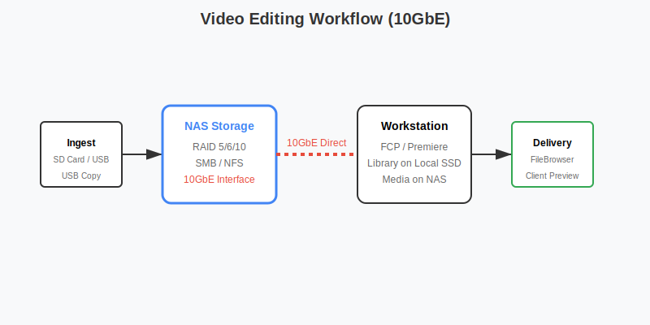

# 摄影与影视后期：群晖 NAS 终极解决方案

对于摄影师、视频剪辑师和后期制作团队来说，数据是核心资产。群晖 NAS 不仅仅是存储设备，更是高效的媒资管理中心（MAM）和协作平台。

本指南将提供 **10GbE 性能调优参数**、**Immich 硬件加速配置**以及 **FCPX/Premiere 协作**的硬核实战技巧。

## 1. 存储与网络：榨干万兆 (10GbE) 性能

仅仅插上万兆网卡是不够的，你需要进行参数调优才能跑满 1000MB/s。

### 1.1 物理链路检查

**非线性编辑 (NLE) 工作流示意图：**



*   **MTU (巨型帧)**：
    *   **建议**：在**没有**复杂交换机环境的直连模式下，将 NAS 和电脑的 MTU 都设为 `9000`，理论上可减少 CPU 中断，提升 5-10% 吞吐量。
    *   **警告**：如果中间经过不支持 Jumbo Frame 的交换机，会导致丢包严重。对于大多数用户，保持默认 `1500` 更稳定。
*   **线缆**：必须使用 Cat6a 或 Cat7 线缆。

### 1.2 SMB 协议调优 (CLI 实战)
DSM 界面无法调整所有参数。SSH 登录 NAS，编辑 `/etc/samba/smb.conf` (注意：DSM 升级可能会重置，建议放入开机脚本)。

```bash
# 检查当前 SMB 状态
smbstatus

# 推荐添加到 [global] 部分的优化参数
# 警告：修改前务必备份 smb.conf
server multi channel support = yes
aio read size = 1
aio write size = 1
# 针对 macOS 的特殊优化 (vfs_fruit)
vfs objects = catia fruit streams_xattr
fruit:metadata = stream
fruit:model = MacSamba
fruit:posix_rename = yes
fruit:veto_appledouble = no
fruit:nfs_aces = no
fruit:wipe_intentionally_left_blank_rfork = yes
fruit:delete_empty_adfiles = yes
```
*   *注意*：DSM 7.2+ 已经内置了大部分 `vfs_fruit` 优化，建议先在 `控制面板` > `文件服务` > `SMB` > `高级设置` > `Mac` 中勾选相关选项。

## 2. 媒资管理：Immich 硬件加速与 AI 调优

Immich 是 Google Photos 的最佳自托管替代品。对于拥有数万张 RAW 格式照片的摄影师，默认配置远远不够。

### 2.1 Docker Compose (启用硬件转码)
让 NAS 的核显 (Intel QuickSync) 处理视频缩略图和转码，解放 CPU。

```yaml
version: '3.8'
services:
  immich-server:
    image: ghcr.io/immich-app/immich-server:release
    devices:
      - /dev/dri:/dev/dri # 直通核显
    environment:
      - DB_HOSTNAME=immich-postgres
      - DB_USERNAME=postgres
      - DB_PASSWORD=postgres
      - DB_DATABASE_NAME=immich
      - IMMICH_MACHINE_LEARNING_URL=http://immich-machine-learning:3003
    volumes:
      - /volume1/docker/immich/upload:/usr/src/app/upload
      - /etc/localtime:/etc/localtime:ro
    restart: always

  immich-machine-learning:
    image: ghcr.io/immich-app/immich-machine-learning:release
    environment:
      - IMMICH_MACHINE_LEARNING_URL=http://immich-machine-learning:3003
    volumes:
      - model-cache:/cache
    restart: always

volumes:
  model-cache:
```

### 2.2 机器学习模型调优
在 Immich 网页后台 > `Administration` > `Machine Learning Settings`：
*   **CLIP Model (智能搜索)**：默认的 `ViT-B-32` 较弱。如果 NAS 内存 > 8GB，推荐切换为 `XLM-Roberta-Large-Vit-B-16Plus` (多语言支持更好，中文搜索更准)。
*   **Facial Recognition (人脸识别)**：推荐 `antelopev2`，对亚洲人脸识别准确率更高。

## 3. 非线性编辑 (NLE) 协作痛点

### Final Cut Pro (FCP)
*   **痛点**：FCP Library (`.fcpbundle`) 默认不支持存放在 SMB 共享上（会提示 Unsupported Volume）。
*   **解决方案**：
    1.  **NFS 挂载**：FCP 对 NFS 的支持比 SMB 好。在 NAS 开启 NFS 服务，Mac 上使用 `nfs://nas-ip/share` 挂载。
    2.  **本地库 + 媒体库分离 (推荐)**：
        *   新建 Library 时，将 Library 文件存在**本地 SSD** (速度快，无锁问题)。
        *   在 FCP 属性中，将 `Storage Locations` > `Media` 设置为 **NAS 路径**。
        *   这样只有几十 MB 的数据库在本地，几 TB 的素材在 NAS。

### Adobe Premiere Pro
*   **痛点**：多人同时打开同一个项目文件会覆盖。
*   **解决方案**：
    *   **Team Projects**：Adobe 官方的云协作方案（需要订阅）。
    *   **项目锁定**：确保 NAS 开启了 SMB 的 `oplocks` (默认开启)。当一个人打开 `.prproj` 时，其他人以只读方式打开。

## 4. 自动化素材摄入 (Ingest Workflow)

使用 **USB Copy** 配合自定义脚本实现“插卡即整理”。

### 4.1 基础：USB Copy
在套件中心安装 USB Copy，设置插入 SD 卡自动复制到 `/volume1/Inbox/YYYY-MM-DD`。

### 4.2 进阶：Exiftool 自动重命名 (Shell 脚本)
USB Copy 只能按导入日期命名。如果你想按**拍摄日期**重命名，需要脚本。

1.  安装 `ExifTool` (通过 Entware: `opkg install perl-image-exiftool`)。
2.  编写脚本 `/volume1/scripts/organize_photos.sh`:
    ```bash
    #!/bin/bash
    TARGET_DIR="/volume1/Photo_Library"
    INBOX_DIR="/volume1/Inbox"
    
    # 查找 Inbox 下的所有 JPG/ARW/CR2 文件
    find "$INBOX_DIR" -type f \( -iname "*.jpg" -o -iname "*.arw" -o -iname "*.cr2" \) | while read FILE; do
        # 读取拍摄日期 (YYYY/MM)
        DATE_PATH=$(exiftool -d "%Y/%m" -DateTimeOriginal -S -s "$FILE")
        # 移动到目标目录
        mkdir -p "$TARGET_DIR/$DATE_PATH"
        mv -n "$FILE" "$TARGET_DIR/$DATE_PATH/"
    done
    ```
3.  在任务计划中设置每小时运行一次，或者在 USB Copy 完成后触发（需高级技巧监控 USB 状态）。

## 5. 客户交付：FileBrowser 定制

给客户发链接太简陋？用 FileBrowser 搭建品牌门户。
*   **Logo 定制**：在 FileBrowser 设置中上传工作室 Logo。
*   **权限隔离**：
    *   用户 `Client_A` -> 只能看 `/Projects/Client_A/Deliverables`
    *   用户 `Client_B` -> 只能看 `/Projects/Client_B/Deliverables`
*   **在线预览**：FileBrowser 支持直接播放 MP4 和预览 JPG，客户无需下载即可确认样片。

---
**总结**：通过 10GbE 参数调优、Immich AI 加速、NLE 库分离策略以及自动化的 Ingest 脚本，群晖 NAS 不再是一个单纯的硬盘盒，而是您工作室的**核心生产力服务器**。
