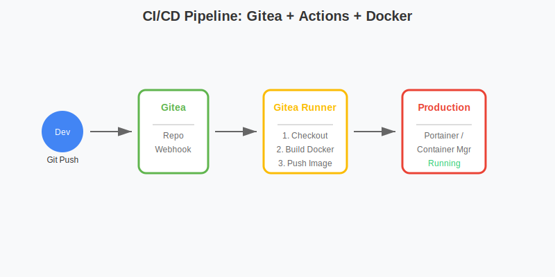

# 程序员与 DevOps：打造私人代码堡垒与 CI/CD 中心

对于开发者而言，群晖 NAS 是一台低功耗、高可用性的 Linux 服务器。本指南将教您如何利用 DSM 构建完整的开发、测试、部署流水线，甚至实现 **Infrastructure as Code**。

本指南涵盖 **Gitea Actions CI/CD 实战**、**Dev Containers 远程开发**以及 **Verdaccio 私有源搭建**。

## 1. 代码托管与 CI/CD：Gitea + Actions

**CI/CD 流水线架构图：**



Gitea 不仅是 Git 仓库，配合 Actions 可以实现类似 GitHub Actions 的自动化构建。

### 1.1 Gitea + Runner 部署 (Docker Compose)
我们需要同时部署 Gitea Server 和 Gitea Runner。

```yaml
version: "3"

services:
  gitea:
    image: gitea/gitea:latest
    container_name: gitea
    environment:
      - USER_UID=1026
      - USER_GID=100
    volumes:
      - ./gitea:/data
    ports:
      - "3000:3000"
      - "2222:22"
    restart: always

  runner:
    image: gitea/act_runner:latest
    container_name: gitea_runner
    environment:
      - GITEA_INSTANCE_URL=http://gitea:3000
      - GITEA_RUNNER_REGISTRATION_TOKEN=<填入你的Token>
      - GITEA_RUNNER_NAME=nas-runner
    volumes:
      - /var/run/docker.sock:/var/run/docker.sock # 允许 Runner 调动宿主机 Docker
    depends_on:
      - gitea
    restart: always
```
*   **获取 Token**：部署 Gitea 后，进入 `管理后台` > `Runner` > `Create Runner` 获取。

### 1.2 编写流水线 (Workflow)
在仓库根目录创建 `.gitea/workflows/build.yaml`。
**实战目标**：代码 Push 后，自动构建 Docker 镜像并部署到 NAS 的 Portainer。

```yaml
name: Build and Deploy
on: [push]

jobs:
  build:
    runs-on: ubuntu-latest
    steps:
      - name: Checkout
        uses: actions/checkout@v3
      
      - name: Set up QEMU
        uses: docker/setup-qemu-action@v2
      
      - name: Set up Docker Buildx
        uses: docker/setup-buildx-action@v2
      
      - name: Login to Docker Hub
        uses: docker/login-action@v2
        with:
          username: ${{ secrets.DOCKER_USERNAME }}
          password: ${{ secrets.DOCKER_PASSWORD }}
      
      - name: Build and push
        uses: docker/build-push-action@v4
        with:
          context: .
          push: true
          tags: user/myapp:latest

      - name: Trigger Webhook (Deploy)
        run: curl -X POST ${{ secrets.PORTAINER_WEBHOOK }}
```

## 2. 洁癖开发环境：VS Code Dev Containers

不要在你的 Mac/PC 上安装 Python, Node, Go, Rust... 把它们都装在 NAS 的容器里！

### 2.1 原理
VS Code (本地) -> SSH -> NAS (Docker 容器)。你的代码和运行环境都在 NAS 上，本地只负责 UI 显示。

### 2.2 配置步骤
1.  在 NAS 上启动一个基础开发容器（例如 `mcr.microsoft.com/devcontainers/python:3`），并映射工作目录。
2.  在 VS Code 安装 **Remote - Development** 插件包。
3.  点击左下角 `><` 图标，选择 `Remote-SSH: Connect to Host` 连接到 NAS。
4.  连接成功后，在左侧 Docker 栏中找到那个开发容器，右键 `Attach to Container`。
5.  **效果**：你现在的终端是 Linux 环境，安装 pip 包不会污染你的 Mac，且编译使用的是 NAS 的 CPU。

## 3. 私有 NPM/PyPI 代理：Verdaccio

加速 `npm install` 并托管私有包。

### 3.1 部署 Verdaccio
```yaml
version: '3'
services:
  verdaccio:
    image: verdaccio/verdaccio
    container_name: verdaccio
    ports:
      - "4873:4873"
    volumes:
      - ./storage:/verdaccio/storage
      - ./config:/verdaccio/conf
```

### 3.2 使用
*   **设置源**：`npm set registry http://nas-ip:4873`
*   **发布私有包**：`npm publish` (包会存在 NAS 上)。
*   **加速**：当请求公共包（如 React）时，Verdaccio 会缓存一份在 NAS，下次安装秒开。

## 4. 基础设施即代码：Ansible 管理 NAS

你是想手动点点点，还是写代码管理 NAS？

### 4.1 准备
在 NAS 控制面板开启 SSH 功能。

### 4.2 Playbook 示例 (`nas_setup.yml`)
```yaml
- hosts: my_nas
  tasks:
    - name: Ensure Docker group exists
      group:
        name: docker
        state: present

    - name: Create shared folder for projects
      file:
        path: /volume1/projects
        state: directory
        owner: admin
        group: users
        mode: '0755'

    - name: Deploy Portainer
      docker_container:
        name: portainer
        image: portainer/portainer-ce
        state: started
        restart_policy: always
        ports:
          - "9000:9000"
        volumes:
          - /var/run/docker.sock:/var/run/docker.sock
          - portainer_data:/data
```
运行 `ansible-playbook -i inventory nas_setup.yml`，一键配置新 NAS。

---
**总结**：通过 Gitea Actions 实现自动化交付，Dev Containers 实现环境隔离，Verdaccio 加速依赖管理，Ansible 实现配置即代码，您已将 NAS 升级为**企业级 DevOps 平台**。
