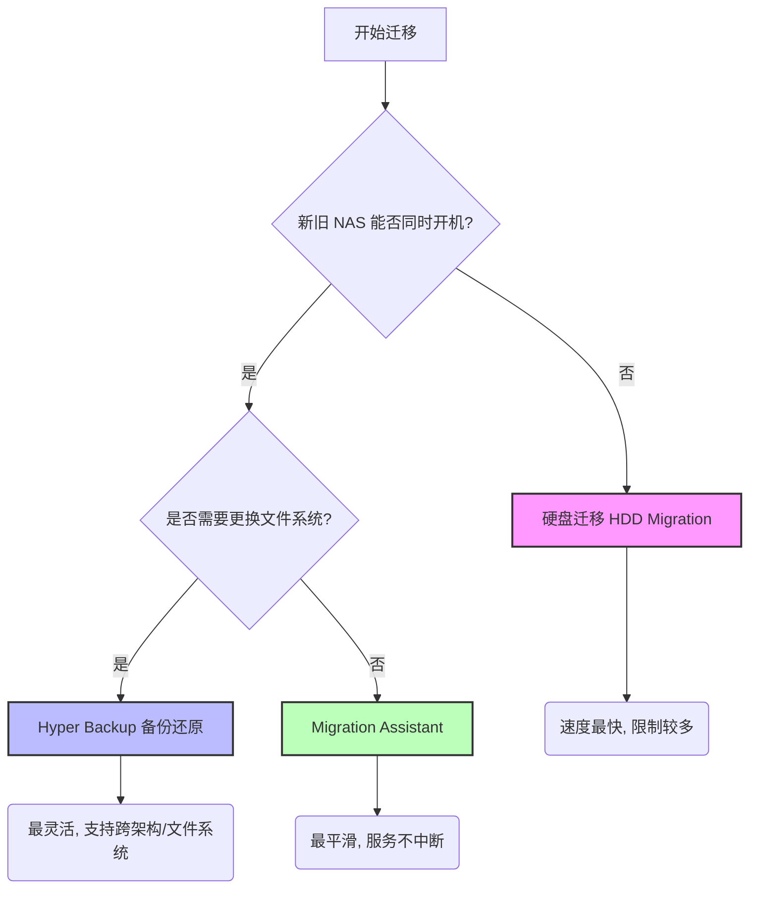
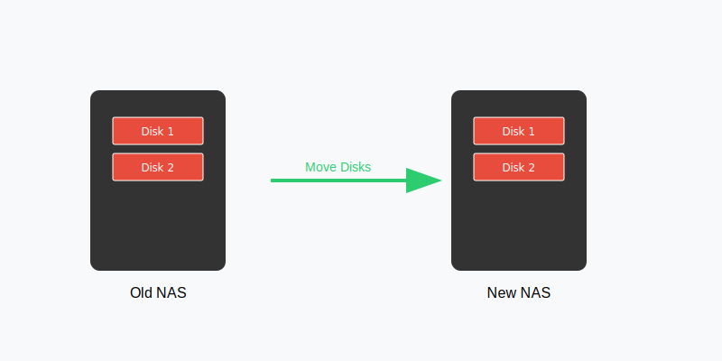
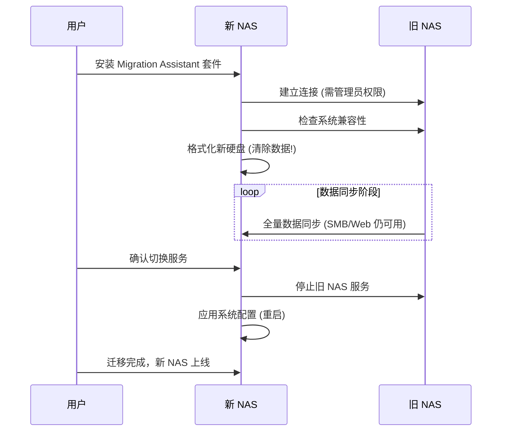
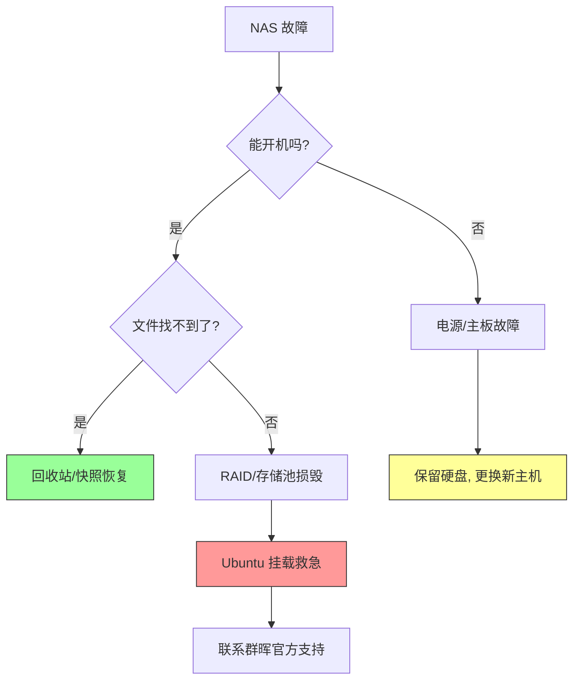
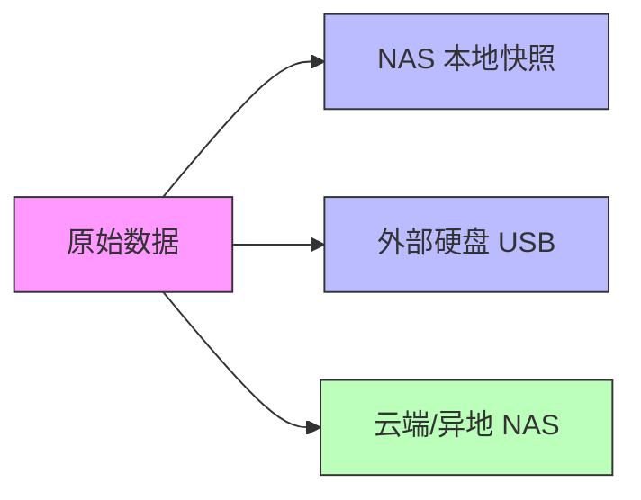

# 数据迁移与灾难恢复指南

数据是 NAS 的核心。无论是更换新设备，还是应对硬盘故障，掌握正确的数据迁移和恢复方法至关重要。

## 三种主流迁移方式对比

群晖官方提供了三种主要的迁移方式，适用于不同的场景。

### 1. 硬盘迁移 (HDD Migration)

**最快，但有限制。**

*   **原理**：直接将旧 NAS 的硬盘拔出，按顺序插入新 NAS。
*   **适用场景**：
    *   旧 NAS 坏了，但硬盘没坏。
    *   升级到盘位更多或同系列的机型。
*   **限制**：
    *   **不能降级**：新机型必须比旧机型更新或同级（例如不能从 DS920+ 迁移到 DS218+）。
    *   **盘位限制**：新 NAS 盘位必须 >= 旧 NAS。
    *   **系统限制**：某些高端系列（XS/XS+）不支持从低端系列（J/Play）直接插盘迁移。
*   **步骤**：
    1.  备份配置（控制面板 > 更新和还原 > 配置备份）。
    2.  关机，拔盘。
    3.  **按原顺序**插入新 NAS。
    4.  开机，通过 find.synology.com 查找，状态会显示“可迁移”。
    5.  按提示安装 DSM（选择“保留数据和设置”）。

### 2. Migration Assistant

**最平滑，服务不中断。**

*   **原理**：通过局域网，将一台 NAS 的所有数据、设置、套件“克隆”到另一台 NAS。
*   **适用场景**：
    *   新旧两台 NAS 都能正常开机。
    *   想要最完整的系统迁移（包括 Docker 容器、套件设置）。
*   **优点**：迁移过程中，旧 NAS 的服务（如 SMB、Web）仍可访问。
*   **缺点**：非常耗时（取决于数据量和网络速度）。
*   **步骤**：
    1.  在新 NAS 上安装 **Migration Assistant** 套件。
    2.  打开套件，按向导连接旧 NAS。
    3.  系统会自动同步数据。

### 3. Hyper Backup 备份还原

**最灵活，跨文件系统。**

*   **原理**：先将数据备份到外部设备（USB硬盘）或另一台 NAS，再在新 NAS 上还原。
*   **适用场景**：
    *   想从 EXT4 文件系统转换为 Btrfs 文件系统（插盘迁移无法更改文件系统）。
    *   跨度很大的机型升级。
*   **步骤**：
    1.  **备份**：在旧 NAS 上使用 Hyper Backup，选择“本地文件夹和 USB”或“远程 NAS”，备份所有文件夹和应用。
    2.  **还原**：在新 NAS 上打开 Hyper Backup，点击左下角 **还原** > **数据**，选择刚才的备份文件。

## 灾难恢复 (Disaster Recovery)

当 NAS 彻底挂了，如何救数据？

### 场景 A：NAS 主板坏了，硬盘完好
1.  买一台新的群晖 NAS（或借一台）。
2.  执行 **硬盘迁移**。
3.  数据和配置都能回来。

### 场景 B：误删文件
1.  **回收站**：先看 File Station 的 `#recycle` 文件夹。
2.  **快照 (Snapshot)**：如果开启了快照，右键文件夹 > 快照 > 还原。
3.  **Hyper Backup**：从备份中提取单个文件。

### 场景 C：RAID 损毁 (Crash)
这是最危险的情况，通常是因为多块硬盘同时损坏。
1.  **不要乱动**：不要尝试重建 RAID，不要拔插硬盘。
2.  **Ubuntu 挂载救急**：
    *   找一台 PC，制作 Ubuntu Live USB 启动盘。
    *   将所有 NAS 硬盘连接到 PC。
    *   在 Ubuntu 中安装 `mdadm` 和 `lvm2`。
    *   挂载 RAID 阵列，尝试读取数据（详见群晖官网“如何使用 PC 恢复数据”）。
3.  **求助官方**：提交工单，群晖工程师可以远程 SSH 尝试修复文件系统。

## 黄金法则：3-2-1 备份

永远不要只依靠 RAID。RAID 不是备份！

*   **3** 份数据副本。
*   **2** 种介质（NAS + 移动硬盘/云）。
*   **1** 个异地备份（云端/另一台 NAS）。
