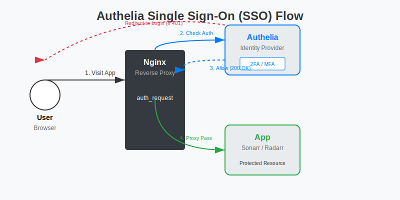

# Authelia：为所有 Docker 服务添加统一认证 (SSO)

你的 NAS 上跑了二三十个服务：Jellyfin, qBittorrent, Sonarr, Radarr, Grafana...
*   **痛点**：每个服务都要单独登录，密码还不一样。有些服务（如静态网页）甚至没有登录功能，直接裸奔在公网。
*   **解决**：**Authelia** 是一个开源的认证中心。它能拦截所有请求，只有登录成功（支持 2FA）才放行。一次登录，全站通行 (Single Sign-On)。

## 1. 架构原理

**SSO 登录流程示意图：**



```mermaid
graph LR
    User --> Nginx[反向代理 (Nginx)]
    Nginx -- 1. 鉴权请求 --> Authelia
    Authelia -- 2. 允许/拒绝 --> Nginx
    Nginx -- 3. 转发 (如果允许) --> App[你的应用 (Sonarr)]
```

## 2. 部署 Authelia (Docker Compose)

我们需要部署三个组件：Authelia (认证), Redis (存储 Session), Nginx Proxy Manager (反代)。

### docker-compose.yml

```yaml
version: '3'
services:
  authelia:
    image: authelia/authelia
    container_name: authelia
    volumes:
      - /volume1/docker/authelia/config:/config
    environment:
      - TZ=Asia/Shanghai
    restart: unless-stopped
    expose:
      - 9091 # 内部端口，不需要映射到宿主机

  redis:
    image: redis:alpine
    container_name: authelia-redis
    volumes:
      - /volume1/docker/authelia/redis:/data
    restart: unless-stopped
    expose:
      - 6379
```

### 配置文件 (configuration.yml)

首次运行会报错，因为缺少配置。在 `/volume1/docker/authelia/config` 下新建 `configuration.yml`：

```yaml
###############################################################
#                   Authelia Configuration                    #
###############################################################

theme: light

jwt_secret: a_very_important_secret_string # 随便填个长的
default_redirection_url: https://auth.yourdomain.com/

server:
  host: 0.0.0.0
  port: 9091

log:
  level: info

totp:
  issuer: authelia.com

authentication_backend:
  file:
    path: /config/users_database.yml # 用户数据库

access_control:
  default_policy: deny # 默认拒绝所有访问
  rules:
    # 允许所有人访问认证页面
    - domain: auth.yourdomain.com
      policy: bypass
    # 允许局域网直接访问，无需认证 (可选)
    - networks:
        - 192.168.1.0/24
      policy: bypass
    # 其他所有子域名需要单因素认证 (1FA)
    - domain: "*.yourdomain.com"
      policy: one_factor # 或者 two_factor (2FA)

session:
  name: authelia_session
  secret: another_very_important_secret_string
  expiration: 3600 # 1小时
  inactivity: 300  # 5分钟无操作自动登出
  domain: yourdomain.com # 必须是根域名，才能实现 SSO
  redis:
    host: authelia-redis
    port: 6379

notifier:
  filesystem:
    filename: /config/notification.txt # 验证码发到这个文件里 (测试用)
    # 生产环境建议配置 SMTP 邮件通知
```

### 用户文件 (users_database.yml)

```yaml
users:
  admin:
    displayname: "Administrator"
    password: "$argon2id$v=19$m=65536,t=3,p=4$..." # 需用 docker run authelia/authelia authelia crypto hash-password '你的密码' 生成
    email: admin@example.com
    groups:
      - admins
```

## 3. 集成 Nginx Proxy Manager (NPM)

现在我们要让 NPM 把请求转发给 Authelia 验证。

1.  **NPM 高级配置**：
    在 NPM 的安装目录（通常是 `data/nginx/custom`）下创建一个 `authelia.conf` 片段：

    ```nginx
    # Authelia 鉴权片段
    auth_request /authelia;
    auth_request_set $target_url $scheme://$http_host$request_uri;
    auth_request_set $user $upstream_http_remote_user;
    auth_request_set $groups $upstream_http_remote_groups;
    proxy_set_header Remote-User $user;
    proxy_set_header Remote-Groups $groups;
    error_page 401 =302 https://auth.yourdomain.com/?rd=$target_url;

    location /authelia {
        internal;
        proxy_pass http://authelia:9091/api/verify;
        proxy_set_header X-Original-URL $scheme://$http_host$request_uri;
        proxy_set_header X-Forwarded-Method $request_method;
        proxy_set_header X-Forwarded-Proto $scheme;
        proxy_set_header X-Forwarded-Host $http_host;
        proxy_set_header X-Forwarded-Uri $request_uri;
        proxy_set_header X-Forwarded-For $remote_addr;
        proxy_set_header Content-Length "";
        proxy_set_header X-Original-Method $request_method;
    }
    ```

2.  **配置代理主机**：
    *   **auth.yourdomain.com**: 指向 `http://authelia:9091`。这是登录界面。
    *   **sonarr.yourdomain.com**:
        *   指向 `http://sonarr:8989`。
        *   **Advanced** 选项卡：Custom Nginx Configuration 中输入：
            ```nginx
            include /data/nginx/custom/authelia.conf;
            ```

## 4. 效果

1.  访问 `https://sonarr.yourdomain.com`。
2.  Nginx 拦截请求，发现未登录，返回 401。
3.  自动跳转到 `https://auth.yourdomain.com`。
4.  输入账号密码（或 TOTP 验证码）。
5.  验证成功，自动跳回 Sonarr 页面。
6.  再次访问 `https://radarr.yourdomain.com`，**无需再次登录**，直接进入。

## 5. 进阶：双因素认证 (2FA)

Authelia 原生支持 TOTP (Google Authenticator) 和 Duo Push。
*   在 `configuration.yml` 中将策略改为 `two_factor`。
*   用户首次登录后，会提示扫描二维码绑定 Authenticator App。
*   安全性达到银行级别。
