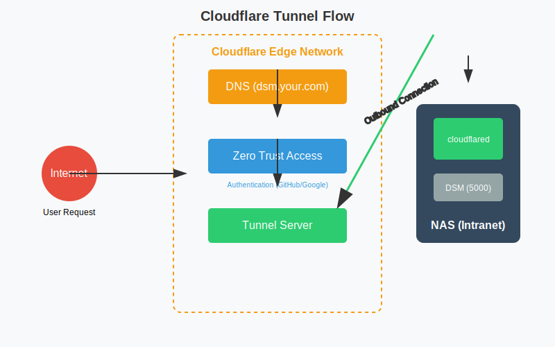

# Cloudflare Tunnel (Zero Trust) 深度实战

Cloudflare Tunnel (CF Tunnel) 是完全免费的内网穿透神器，它不仅不需要公网 IP，而且自带企业级安全防护（Zero Trust Access）。

本指南将教你如何配置 **Public Hostname** 暴露服务，如何设置 **Access Policies** 保护敏感应用，以及如何利用 **WARP Client** 访问整个内网。

## 1. 为什么选择 Cloudflare Tunnel？

*   **完全免费**：不需要购买 VPS，不需要公网 IP。
*   **安全**：不需要在路由器开端口（防火墙可以完全关闭入站流量）。
*   **Zero Trust**：即便是暴露在公网的服务，也可以强制要求用户登录（如 Google 账号、GitHub 账号）才能访问。
*   **Web 界面管理**：配置极其直观。



## 2. 部署 Connector (Docker)

Cloudflare Tunnel 需要在 NAS 上运行一个 `cloudflared` 守护进程（Connector）。

### 准备工作
1.  **Cloudflare 账号**：拥有一个域名并托管在 Cloudflare。
2.  **Zero Trust Dashboard**：进入 [One Dashboard](https://one.dash.cloudflare.com/) > Networks > Tunnels。
3.  **创建 Tunnel**：点击 Create a tunnel > 选择 Cloudflared > 复制 Token。

### docker-compose.yml
```yaml
services:
  tunnel:
    image: cloudflare/cloudflared:latest
    container_name: cloudflared
    restart: always
    command: tunnel --no-autoupdate run --token <你的TOKEN>
```
启动后，Dashboard 上会显示 Status: Healthy。

## 3. Public Hostname：暴露服务

这是最常用的功能。你可以把 NAS 上的 Web 服务映射到一个子域名。

### 配置步骤
1.  在 Tunnel 详情页，点击 **Configure** > **Public Hostname**。
2.  点击 **Add a public hostname**。
3.  **Subdomain**: `dsm` (例如 dsm.yourdomain.com)。
4.  **Service**:
    *   **Type**: HTTP
    *   **URL**: `192.168.1.100:5000` (NAS 局域网 IP:端口)
5.  **Save hostname**。
6.  稍等片刻，全球各地都可以访问 `https://dsm.yourdomain.com` 了。

### 进阶：HTTPS 回源
有些服务（如 ESXi、Proxmox）强制 HTTPS。
*   **Type**: HTTPS
*   **URL**: `192.168.1.100:443`
*   **TLS Verify**: 展开 **Additional application settings** > **TLS** > 开启 **No TLS Verify**（因为内网通常是自签名证书）。

## 4. Zero Trust Access：安全防护

直接暴露 DSM 或 SSH 是非常危险的。Cloudflare Access 可以让你给服务加把锁。

### 配置步骤
1.  在 Zero Trust Dashboard > **Access** > **Applications**。
2.  **Add an application** > **Self-hosted**。
3.  **Application name**: `DSM Admin`。
4.  **Application domain**: `dsm.yourdomain.com` (必须与 Tunnel 中配置的一致)。
5.  **Identity providers**: 选择你配置的登录方式（如 Google, GitHub, One-time PIN）。
6.  **Policies** (规则)：
    *   **Rule name**: `Allow Admin`
    *   **Action**: `Allow`
    *   **Include**: `Emails` -> `your@email.com` (只允许你自己访问)
7.  **Save application**。

### 效果
现在访问 `dsm.yourdomain.com`，不再直接显示登录页，而是跳转到 Cloudflare Access 登录页。只有通过验证（如 GitHub 授权），才能看到 DSM 界面。**黑客连你的登录框都摸不到。**

## 5. Private Network (WARP)：访问整个内网

如果你不想一个个配置 Public Hostname，或者需要访问非 HTTP 协议（如 SMB, RDP），可以使用 Private Network 模式。

### 配置步骤
1.  在 Tunnel 详情页 > **Private Network**。
2.  **Add a private network**。
3.  **CIDR**: `192.168.1.0/24` (你的局域网网段)。
4.  **Save network**。

### 客户端连接
1.  在电脑/手机上安装 **Cloudflare WARP** 客户端。
2.  登录你的 Zero Trust 组织（在 Settings > Account > Login with Cloudflare Zero Trust）。
3.  连接 WARP。
4.  现在，你可以直接 ping 通 `192.168.1.100`，就像连了 VPN 一样。你可以直接挂载 SMB 共享文件夹！

### 优化：分离隧道 (Split Tunneling)
默认情况下，WARP 会代理所有流量，导致你访问国内网站变慢。你需要设置“分离隧道”，只代理公司/家庭内网的流量。

1.  在 Zero Trust Dashboard > **Settings** > **WARP Client**。
2.  找到 **Device settings** > **Profile settings**。
3.  点击 Configure，进入 **Split Tunnels**。
4.  选择 **Exclude IPs and domains** (排除模式 - 推荐) 或 **Include** (包含模式)。
    *   **推荐做法**：选择 **Exclude**，列表里默认包含了所有公网 IP。
    *   **添加例外**：确保你的内网网段 `192.168.1.0/24` **不在** Exclude 列表中（即删除它），这样内网流量才会走 WARP 隧道，而访问百度/淘宝走本地网络。

## 6. 常见问题

### Q1: 速度慢？
*   Cloudflare 的边缘节点虽然遍布全球，但在国内连接有时会绕路。
*   **优化**：虽然没办法改变物理链路，但可以通过优选 IP（需自建 CDN 中转，较复杂）改善。对于 NAS 管理、网页浏览来说，速度通常是可以接受的。

### Q2: 无法上传大文件？
*   Cloudflare 免费版对上传文件大小有限制（默认 100MB）。
*   **解决**：在 Dashboard > Settings > Network > **Maximum upload size** 中调整（最大支持到几百 MB）。如果需要传几个 GB 的电影，建议使用 Tailscale 或 FTP/WebDAV 直连，不要走 CF Tunnel。
