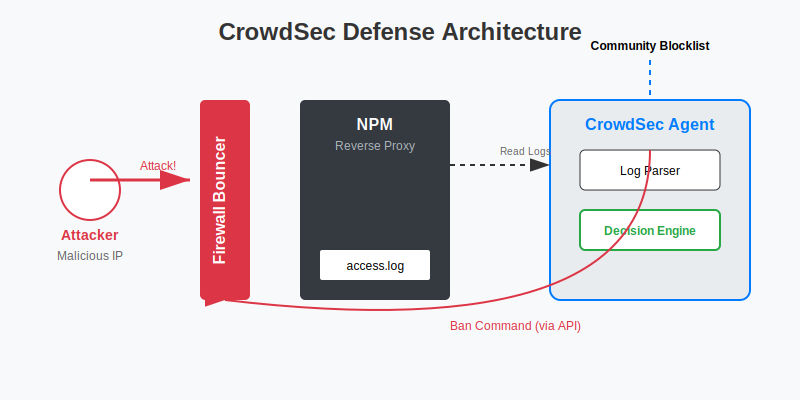

# CrowdSec：现代化的安全防御 (WAF)

你把 NAS 暴露在公网，每天会有成千上万次恶意扫描（SSH 爆破、Web 漏洞扫描）。Fail2Ban 是老牌防御工具，而 **CrowdSec** 是更现代的选择。
*   **云端协同**：如果一个 IP 攻击了别人的 CrowdSec 节点，它会被加入全球黑名单。当这个 IP 试图访问你的 NAS 时，直接被秒杀。
*   **无感防御**：不仅能封 IP，还能让攻击者输入验证码 (Captcha)。

## 1. 架构：Nginx Proxy Manager + CrowdSec

**CrowdSec 防御架构图：**



最常见的场景是：所有流量通过 Nginx Proxy Manager (NPM) 进入，我们要在 NPM 层面拦截恶意 IP。

### 部署 CrowdSec (Docker Compose)

我们需要部署 `crowdsec` (核心引擎) 和 `npm-crowdsec-bouncer` (拦截器，或者集成在 NPM 中)。这里推荐**非侵入式方案**：通过读取 NPM 日志来分析攻击。

```yaml
version: '3'
services:
  crowdsec:
    image: crowdsecurity/crowdsec
    container_name: crowdsec
    environment:
      - PGID=100
      - COLLECTIONS=crowdsecurity/nginx-proxy-manager crowdsecurity/http-cve
    volumes:
      - /volume1/docker/crowdsec/config:/etc/crowdsec
      - /volume1/docker/crowdsec/data:/var/lib/crowdsec/data
      # 关键：挂载 NPM 的日志目录，让 CrowdSec 读取
      - /volume1/docker/npm/data/logs:/var/log/npm:ro
    restart: unless-stopped
```

*   **COLLECTIONS**: 自动安装针对 NPM 和 HTTP 漏洞的规则集。
*   **日志挂载**: 必须确保 CrowdSec 能读取到 NPM 的 `access.log` 和 `error.log`。

## 2. 配置解析器 (Parser)

CrowdSec 需要知道怎么解析 NPM 的日志格式。
在 `/volume1/docker/crowdsec/config/acquis.yaml` 中添加：

```yaml
filenames:
  - /var/log/npm/*.log
labels:
  type: nginx-proxy-manager
```

重启 CrowdSec 容器。此时它开始默默分析日志，但还不会拦截。

## 3. 安装拦截器 (Bouncer)

我们要阻止恶意 IP 访问。由于修改 NPM 容器比较麻烦，我们可以使用 **Firewall Bouncer** (直接操作宿主机 iptables) 或 **OpenResty Bouncer** (集成进 NPM)。
**推荐方案：Firewall Bouncer (Docker)**
它会通过 iptables 直接丢弃黑名单 IP 的包，性能最高。

1.  **获取 API Key**:
    进入 CrowdSec 容器：
    ```bash
    docker exec -it crowdsec cscli bouncers add firewall-bouncer
    ```
    记录生成的 API Key。

2.  **部署 Bouncer**:
    ```yaml
    services:
      firewall-bouncer:
        image: crowdsecurity/firewall-bouncer-docker
        container_name: firewall-bouncer
        environment:
          - API_URL=http://crowdsec:8080
          - API_KEY=你的API_KEY
        # 必须使用 host 网络模式才能操作宿主机 iptables
        network_mode: host
        privileged: true
        restart: unless-stopped
    ```

## 4. 验证与管理

### 常用命令 (CSCLI)

所有操作都在 CrowdSec 容器内进行：
`docker exec -it crowdsec cscli ...`

*   **查看封禁列表**: `cscli decisions list`
*   **手动封禁 IP**: `cscli decisions add --ip 1.2.3.4 --duration 24h --reason "manual ban"`
*   **解封 IP**: `cscli decisions delete --ip 1.2.3.4`
*   **更新规则**: `cscli hub update && cscli hub upgrade`

### 可视化面板 (Metabase)
CrowdSec 官方提供了一个 Docker 镜像用于展示图表，或者注册 CrowdSec Console (SaaS) 在云端查看你的 NAS 拦截了多少攻击。

## 5. 进阶：SSH 保护

除了 Web 流量，CrowdSec 也能保护 SSH。
1.  在 `docker-compose.yml` 中挂载宿主机的 `/var/log/auth.log` (Synology 的 SSH 日志位置可能不同，通常在 `/var/log/messages` 或 `/var/log/synolog/synosys.log`，需仔细确认)。
2.  在 `acquis.yaml` 中添加 syslog 解析。
3.  **注意**：DSM 的日志格式可能非标准，解析较难。对于 SSH，建议直接使用 DSM 自带的 **自动封锁 (Auto Block)** 功能（控制面板 > 安全性 > 保护），设置 5 分钟内 3 次失败永久封锁，效果已经足够好。
