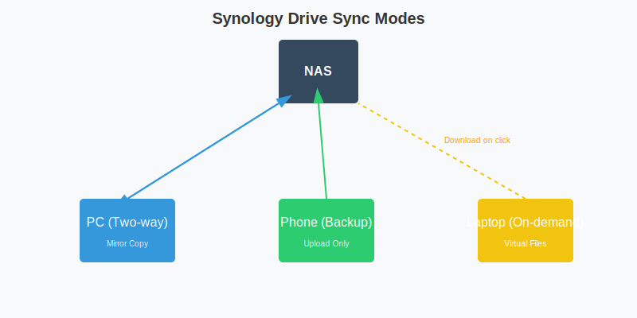

# Synology Drive 深度实战指南

Synology Drive 绝不仅仅是一个简单的“文件同步工具”（像 Dropbox/百度网盘）。它是企业级的私有云协作平台，集成了版本控制、团队文件夹、按需同步、Office 在线协作等功能。用好了它，你的 NAS 价值翻倍。

## 1. 版本控制 (Version Control)

这是 Drive 最核心、也是最容易被忽视的功能。

*   **痛点**：误删了文件？改乱了文档？想找回 3 天前的版本？
*   **原理**：Drive 利用 Btrfs 的写时复制 (CoW) 特性，记录文件的每一次修改。
*   **配置**：
    1.  打开 **Synology Drive 管理控制台**。
    2.  **团队文件夹** > 选择文件夹 > **版本控制**。
    3.  **最大版本数量**：建议设置为 32。
    4.  **轮换策略**：选择 **Intelliversioning**。这是一种智能算法，它不会傻傻地保留最近的 32 个版本，而是会保留“今天每小时、本周每天、本月每周”的版本，时间跨度更广，更实用。

## 2. 按需同步 (On-demand Sync)

这是节省电脑硬盘空间的神器（类似于 OneDrive 的“释放空间”）。
*   **痛点**：NAS 里存了 10TB 电影，我想在电脑上看到目录，但不想把 10TB 都下载下来塞爆我的 MacBook。
*   **配置**：
    1.  在电脑端安装 **Synology Drive Client**。
    2.  创建同步任务时，勾选 **启用按需同步**。
*   **效果**：
    *   文件旁边会有一个“云朵”图标。此时它只占几 KB 空间（元数据）。
    *   **双击打开**：电脑会自动从 NAS 下载该文件，图标变为“实心对勾”。
    *   **释放空间**：右键文件 > **释放空间**。文件内容被删除，变回“云朵”，但并未从 NAS 删除。

## 3. 团队文件夹与权限管理

Drive 不仅能同步个人文件 (`/home/Drive`)，还能同步共享文件夹 (`/volume1/projects`)。
*   **启用**：在管理控制台 > **团队文件夹** 中启用特定的共享文件夹。
*   **权限**：Drive 的权限直接继承自 DSM 的 File Station 权限。
    *   如果 User A 在 File Station 对 `Project A` 只有“只读”权限，那么他在 Drive 客户端里也只能下载，不能上传或修改。
*   **高级权限**：可以设置“禁止下载/复制”。这在企业环境中保护机密文件很有用。

## 4. Synology Office 在线协作

Drive 配合 Synology Office 套件，可以实现类似 Google Docs / 腾讯文档 的多人实时在线编辑。
*   **安装**：在套件中心安装 **Synology Office**。
*   **使用**：
    1.  在 Drive 网页版，点击 **+** > **文档/电子表格/幻灯片**。
    2.  或者导入现有的 `.docx` / `.xlsx` 文件（会自动转换为 Synology 格式）。
    3.  **分享**：点击右上角“分享”，设置权限（可编辑/只读），发送链接给同事。
    4.  **协作**：多个人同时打开链接，可以看到对方的光标和输入内容，实时同步。
    5.  **历史记录**：Office 文档有独立的版本历史，可以精确到“谁在几点几分修改了哪个单元格”。

## 5. 手机端备份与微信文件备份

Synology Drive 手机 App 也是备份神器。
*   **相册备份**：虽然 Photos 更专业，但 Drive 也能备份照片。
*   **微信文件备份** (Android)：
    1.  在 Drive App 中，点击 **+** > **上传** > **选择文件夹**。
    2.  找到微信的保存目录（通常是 `Tencent/MicroMsg/Download`）。
    3.  设置 **仅在 Wi-Fi 下备份**。
    4.  从此，微信里接收的文件会自动同步到 NAS，再也不怕“文件已过期或被清理”。

## 6. 常见问题 (FAQ)

### Q1: Drive 占用空间巨大？
这是因为开启了版本控制。虽然 Btrfs 是增量备份，但如果你频繁修改大文件（如视频剪辑工程文件），版本历史确实会占用大量空间。
*   **解决**：
    1.  减少版本数量（如改为 8）。
    2.  在版本控制设置中，**取消勾选**“为重命名/移动的文件创建版本”。
    3.  定期清理旧版本：管理控制台 > 设置 > 清理数据库。

### Q2: 同步速度慢？
*   **局域网**：通常能跑满千兆 (100MB/s)。如果慢，检查是否走了 QuickConnect 中转（QC 很慢）。建议使用 IP 直连或 DDNS。
*   **小文件**：如果有大量小文件（如 `node_modules`），同步速度会显著下降。这是物理定律，无解。建议打包成 zip 再同步，或在客户端设置中**排除**这些文件夹。

### Q3: 文件冲突？
当两个人同时修改同一个文件时，会产生冲突。
*   Drive 会自动保留两个版本，其中一个重命名为 `文件名_Conflict_日期`。
*   需要人工介入合并内容。
