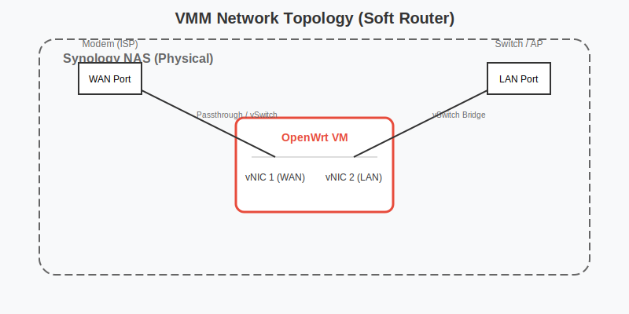

# Virtual Machine Manager (VMM) 实战技巧

在 NAS 上运行 Windows 或 Linux 虚拟机，让你的 NAS 变成一台真正的服务器。

## 1. 硬件要求与性能优化
- **内存**：这是瓶颈。运行 Windows 10 至少需要分配 4GB 内存。建议 NAS 内存升级到 8GB 或 16GB。
- **SSD 缓存**：**强烈建议**在 SSD 存储空间上运行虚拟机。机械硬盘的 IOPS 太低，会导致 Windows 卡顿到无法使用。
- **VirtIO 驱动**：安装 Windows 时，务必加载 Synology Guest Tool 中的 VirtIO 驱动（硬盘和网卡），性能提升巨大。

## 2. Windows 10/11 优化 (LTSC & vTPM)

*   **版本选择**：不要装普通的 Home/Pro 版，臃肿且更新频繁。
*   **推荐**：安装 **Windows 10 Enterprise LTSC** 或 **Windows 11 Enterprise LTSC** (IoT) 版本。去除了 Cortana、Store、Edge 等全家桶，极其精简稳定，非常适合在 NAS 上长期运行。
*   **Windows 11 支持 (vTPM)**：
    *   **DSM 7.2+**：VMM 原生支持 **虚拟 TPM (vTPM)**。
    *   **设置**：在创建虚拟机时，加密选项中勾选“启用虚拟 TPM”。
    *   **注意**：启用 vTPM 会强制加密虚拟机，这意味着如果密钥丢失（存储在密钥管理器中），虚拟机将无法启动。务必备份密钥！
    *   **替代方案**：如果不想加密，可以使用 Rufus 制作“去除 TPM 检测”的 Windows 11 安装镜像。

## 3. 虚拟软路由 (OpenWrt) 深度调优

在 NAS 上运行软路由（OpenWrt/iKuai）是很多玩家的终极目标，可以实现广告过滤、DNS 优化等功能。但配置不当会导致全家断网。

### A. 网络拓扑规划

*   **双网口 NAS (推荐)**：
    *   **直通模式 (Passthrough)**：将一个网口直通给软路由作为 WAN 口（需支持 VT-d 的 CPU）。
    *   **虚拟交换机模式**：
        *   **WAN**: 虚拟交换机 1 (连接光猫)。
        *   **LAN**: 虚拟交换机 2 (连接交换机/AP)。
*   **单网口 NAS (旁路由模式)**：
    *   **网关指向**：主路由 DHCP 指向 NAS IP，或者手动修改设备的网关指向 NAS。
    *   **风险**：如果 NAS 挂了，全家断网。建议仅将需要特殊功能的设备网关指向 NAS。

### B. 网卡模型选择 (VirtIO vs E1000)
*   **E1000**: 兼容性最好，所有 OpenWrt 版本都支持，但 CPU 占用高，跑不满千兆。
*   **VirtIO**: 性能最强，CPU 占用低。
    *   **注意**：部分精简版 OpenWrt 可能缺少 VirtIO 驱动。如果发现只有几百兆速度，尝试换回 E1000 或更换固件。
    *   **技巧**：在 VMM 编辑虚拟机 > 网络 > 型号中选择。

### C. 避免网络回环 (Loop)
*   **现象**：局域网广播风暴，所有设备断网。
*   **原因**：在单网口模式下，同时开启了 OpenWrt 的 DHCP 和主路由的 DHCP，且网段相同。
*   **解决**：务必关闭 OpenWrt 的 DHCP 服务（作为旁路由时），或者划分 VLAN。

### D. 性能优化
*   **CPU 预留**：软路由是网络核心，必须保证其响应速度。
    *   在 VMM 编辑 > 处理器 > **保留 CPU 线程**。建议保留 1-2 个核心。
*   **半双工问题**：部分驱动会导致虚拟网卡显示为“半双工”，导致速度跑不满。
    *   **解决**：SSH 登录 OpenWrt，运行 `ethtool -s eth0 speed 1000 duplex full autoneg on` 强制全双工。

## 4. 高级玩法：SR-IOV 网卡虚拟化

如果你的 NAS 插了支持 SR-IOV 的网卡（如 Intel X540, ConnectX-3），可以将物理网卡“切片”直通给虚拟机。

1.  **开启 SR-IOV**：SSH 登录 NAS，编辑 `/etc/synoinfo.conf`，添加 `support_sriov="yes"`（部分机型）。
2.  **分配**：在 VMM 网络设置中，将 SR-IOV 虚拟出的网卡（VF）分配给虚拟机。
3.  **优势**：虚拟机直接访问物理网卡硬件，接近物理机性能，且 CPU 占用极低。

## 5. 虚拟机快照与备份

*   **快照**：在进行系统更新（如 OpenWrt 升级）前，务必拍个快照。失败了 1 秒钟还原。
*   **Active Backup for Business**：虽然 VMM 自带保护，但用 ABB 备份 VMM 里的虚拟机（Agent 模式）可以实现更细粒度的文件级恢复。

## 6. 总结

通过 VMM，你的 NAS 不再只是存储，而是一台全能服务器。无论是运行 Windows 办公，还是 OpenWrt 软路由，亦或是 Linux 开发环境，VMM 都能轻松驾驭。记得给虚拟机分配足够的内存和 SSD 缓存，体验会飞起来。
